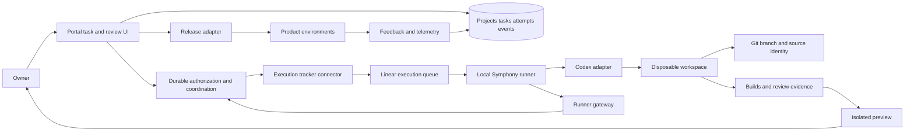

# Architecture proposal

## Shape of the system

Start with a task-driven modular portal and an owner-operated local runner gateway. The portal owns durable project, task, authorization, attempt, artifact, and review records. Linear is the first execution connector; upstream Symphony supplies tracker-driven scheduling, workspaces, and Codex App Server orchestration behind the gateway. Local execution is the first deployment location, not the product interaction model.

Target free-tier portal hosting while the gateway uses existing hardware and supported Codex sign-in. Keep the task/event protocol independent of Symphony, Linear, and the worker location so Jira, a portal-native queue, or server workers can be added without changing task identity or review history. Separate disposable code execution from portal, tracker, and release credentials.

The same project model describes the portal and the products it develops. The portal's own project simply references its own repository and release target. Generated products have independent code, data, runtime credentials, and environments; they need no embedded portal or GitHub integration unless their requirements call for one.

## Shared structure and recursive development

Aludel is a product project governed by the same intent, task, artifact, review and capability contracts as every other project. [The shared framework](product-system-framework.md) defines those contracts; [Aludel allocation](system/the-machine.md) describes this project's own implementation and development choices. Global vocabulary does not require a universal application runtime, schema or component library.

An explicit service binding identifies consumer project, provider project, contract revision, deployed provider revision and evidence. Aludel may be both provider and consumer. A candidate Machine build remains separate from the accepted revision providing development services; review/promotion and recovery cannot depend solely on that candidate. Bootstrap manual/local work and missing runtime integrations remain visible as such. Generated products choose their own stack and design system; no service binding injects portal internals into their runtime.

These are record/protocol constraints for B-01/B-03, not authorization to implement a new capability-management screen or service now.

## Task and execution model

A task is durable before any agent runs. It carries project, intent, acceptance examples, dependencies, priority, readiness, authorization policy, connector mapping, and revisions. Go records who authorized which task revision and moves it into the execution-eligible state. Symphony discovers the corresponding Linear issue and schedules it; the gateway reports normalized events and artifacts to the portal. The UI may use a Go button, board transition, or batch action without changing this contract.

The portal owns task purpose, authorization, attempts, and review. Linear owns its native issue fields and is the first execution queue. Synchronize only explicit mapped fields and transitions using stored external IDs, versions, and operation keys. A conflict or uncertain write becomes a visible reconciliation state. Do not implement generic bidirectional last-write-wins synchronization.

Start with global concurrency set to one to prove recovery within the model's configured capacity. The schema supports multiple claimed tasks, worker leases, project limits, and attempts so growth does not require redesign. Automation later changes eligibility policy; it does not create a second kind of work.

## Low-cost bridge to server execution

The local gateway makes outbound authenticated requests for authorized jobs; the portal does not expose an arbitrary remote shell. It supervises Symphony, reports availability, translates current runner state into durable portal events, and uploads redacted evidence. Show waiting-for-worker when the machine is off. Keep Codex and initial tracker login material on that machine; never upload it to the browser or project database unless a later scoped secret-store design explicitly moves the connector server-side.

Local previews are acceptable for initial owner review. R-04A selects Cloudflare Pages Direct Upload for the first authorized hosted trial and an identified local static server as fallback; Pages is a trial choice, not yet the long-term portal-host decision. Each preview shows its artifact digest, provider deployment identity, immutable URL versus mutable alias, access mode, and availability. If CLI integration fails the feasibility trial, a task-bundle export and result import can bridge bootstrap manually, but must not be presented as a working Go-button integration.

Moving the worker to server compute later should retain the job protocol, project records, and artifact format. Server-side authentication, isolation, cost, and recovery are a separate milestone. No claim that the initial product works while the owner's computer is offline.

## Initial modules and boundaries

| Module | Owns | Does not own |
|---|---|---|
| Product and knowledge | Outcomes, proposals, research, decisions, revisions | Agent-native memory |
| Work coordination | Tasks, dependencies, readiness, authorization, leases, attempts, budgets | Coding strategy inside a run |
| Execution | Workspace lifecycle, adapter invocation, event collection | Production release authority |
| Tracker connections | Explicit task mappings, provider revisions, named transitions, reconciliation | Product intent or review authority |
| Review and artifacts | Preview versions, checks, annotations, acceptance | Mutable branch name as build identity |
| Connections and releases | Scoped integrations, credentials references, deployment records | Credentials in prompts or project documents |
| Observations | Feedback, failures, improvement candidates | Automatic expansion of agent permissions |

Use a shared domain API for UI and agent operations. Do not require a microservice per module. Keep authorization, validation, and audit logic in domain operations so bypassing a screen cannot bypass them.

## Provider interfaces

Define only what the first real integration needs; extend after a second implementation exposes differences.

- **Execution tracker:** create/map a task, read versioned state, apply a named transition, reconcile, link to its native UI.
- **Agent:** describe capabilities, start a run, stream or poll events, cancel, obtain result; resume or answer a question only when supported.
- **Workspace:** create from a source revision, execute bounded operations, snapshot outputs, destroy.
- **Repository:** read revision, create branch/change proposal, obtain diff and checks, merge when authorized.
- **Deployment:** persist a preview operation before create; submit provider-visible build/operation identity; obtain status/logs; reconcile exactly one lookup match; surface zero/multiple matches as unknown/conflict without automatic replay; promote an identified build where supported; retire by provider ID and report cleanup residue; recover a release.

Every run has a portal ID, source commit, input artifact revisions, workflow version, provider/model configuration, policy revision, budget, timestamps, and native references. Retain raw provider events alongside a small normalized event vocabulary. Unsupported capabilities should be visible rather than silently approximated.

Swapping providers is an explicit migration or new run. Switching hosting also involves secrets, DNS, data, and operational differences. Adapters reduce coupling; they do not eliminate this work. Prove portability by moving one representative run and exporting project records.

## State and recovery

Proposed task states: draft → refining → ready → authorized → queued → running → awaiting-decision / awaiting-review → completed. Also support blocked, failed, cancelling, cancelled, and superseded. Connector state and run-attempt state are separate fields, so a delayed tracker write or failed attempt does not corrupt the task's product state. Completion of implementation means a reviewable artifact exists, not that the feature is live. Release state is separate.

Before dispatch, persist the attempt and input revision. Workers claim leases and report heartbeats. On lease expiry, reconcile any external job before dispatching another attempt. Use operation keys for preview creation and other side effects; persist returned provider IDs. If an external service lacks idempotency, look up the prior result or surface ambiguity instead of blindly repeating a write.

Initially let the worker poll and atomically claim committed jobs, avoiding a separate dispatch service. If push dispatch is added, use an outbox or equivalent transactional mechanism. Cancellation stops new work immediately and requests termination of active work; show “cancelling” until confirmed. Preserve partial artifacts and failures. A retry is a new attempt linked to the original.

For M1, use explicit task, authorization, connector-operation, job, attempt, lease, and event records; defer Temporal. Validate recovery before enabling automatic retries or raising concurrency. No distributed transaction or universal exactly-once guarantee is assumed.

R-05 exercised this record split with a separately persisted fake provider and real worker-process termination. Across nine scenarios, stable operation keys plus lookup prevented duplicate mapping/effect creation; cancellation and version conflict stopped before the effect; and an unavailable lookup blocked for reconciliation rather than replaying an uncertain write. This is evidence for the protocol shape, not for JSON-file persistence or any real adapter. See the [recovery spike](evidence/r-05-recovery.md).

## Knowledge storage and import

For bootstrap, these Markdown files are the durable record. They are already insufficient as the long-term store for mutable tasks, design revisions, relationships, and reviews, so M1 introduces the database as product infrastructure rather than treating document import as a complete knowledge experience. The [knowledge strategy](knowledge-strategy.md) defines the authority boundary and agent bootstrap.

At portal import, preserve IDs, metadata, source paths, and original content as the initial revision. Emit an import report with created records, unresolved links, and rejected records. Re-import by stable ID and content hash to avoid duplication.

For the B-01 local bootstrap, SQLite now owns mutable portal requests and immutable imported source revisions behind repository-owned storage operations; this passed idempotency and restart checks. PostgreSQL remains the target adapter for a later hosted topology and concurrency evidence. Git owns code and code-adjacent design sources; object storage will own large immutable artifacts. Markdown/JSON exports remain available. Do not maintain two independently editable sources of truth: subsequent file imports become new immutable source revisions and later gain explicit conflict review rather than silently overwriting database records. See [B-01 evidence](evidence/b-01-local-foundation.md).

Before dispatch, the portal materializes a small immutable task context bundle containing the exact intent, acceptance examples, decision revisions, accepted design inputs, authorization, and typed links needed by the agent. A fresh workspace reads repository `AGENTS.md` plus this bundle and retrieves additional records through a narrow domain API when necessary. It does not crawl the full project corpus by default.

Knowledge records include project scope, type, author/source, created/accessed date, confidence, revision, supersedes link, related features/decisions, and recheck trigger. Search begins with text and typed filters. Add embeddings only when retrieval evaluation demonstrates a need. Agents receive a versioned context bundle for a task, including relevant decisions and exclusions; retain the bundle for reproducibility.

## Decisions as executable workflow inputs

Each question records why it matters, alternatives, recommendation, urgency, affected work, and whether an answer is required. Required questions block dependent work only. Optional preferences can have explicit defaults agreed in project policy; elapsed time alone is not acceptance.

An answer becomes a decision with author and timestamp. Changing it creates a superseding revision and marks dependent plans/builds for reassessment. Review acceptance binds to an artifact digest and proposal revision. If code or requirements change, show that the prior acceptance is stale.

B-02 implements this locally with immutable proposal/decision revisions, optimistic expected-revision checks, explicit decision-to-record bindings that store the consumed revision, transactionally scoped staleness, and explicit reassessment. An unrelated control record remained current in both domain and browser evidence. These operations do not yet model executable tasks, attempts, artifacts, or distributed provider reconciliation. See [B-02 evidence](evidence/b-02-product-records.md).

## Connections in the eventual portal

The owner connects a provider through its supported authorization mechanism, selects the project/repository/environment scope, and sees connection health and capabilities. Store a credential reference on the project; keep the credential itself in a secret store. An agent requests a domain operation, and a narrowly authorized service performs it or issues a short-lived credential where supported.

Separate development and runtime integrations. A client's deployed app may need email or payments while its development project needs a tracker, Git, and builds. Connecting one does not implicitly authorize the other. Preserve external resource IDs and versions for reconciliation and revocation. Linear ships first under ADR-008's field-ownership rules. Jira implements the same connector contract after the first path works; provider-specific fields remain in connector metadata.

### Local GitHub source-control setup — 2026-09-21

The Overview now implements an enterprise-style source-control setup boundary around one deployment-owned vendor GitHub App. App identity and its private key are deployment configuration, never customer-entered data. The owner authorizes with OAuth PKCE/state, installs the app on a user or organization, and selects an eligible installation with all-repository access plus Administration and Contents write. The encrypted, expiring user token discovers installations and is used only where GitHub requires user authority (personal repository creation). Organization repository creation and every Git push use a newly minted installation token; push tokens are restricted to Contents write and the bound repository, passed through process-local askpass, and never persisted or embedded in a remote URL.

Domain tests verify vendor configuration, app JWT signature/lifetime, OAuth state/PKCE, installation-return state and ownership, the organization/personal endpoint-token matrix, per-operation token minting, credential redaction, one remote create across a simulated local failure/retry, and a real initial push to a disposable bare repository. Browser checks cover the operator-unconfigured Overview state at wide and narrow sizes with axe. No real GitHub account was linked and no live repository was created, so provider permission behavior, token refresh against GitHub, revocation, and the first real baseline push remain owner-triggered evidence gaps.

## Preview and self-update lifecycle

The first preview runs outside the portal's trusted origin, with separate cookies and synthetic or explicitly provisioned test data. Bind source commit, build digest, test evidence, screenshot set, and owner annotations to one artifact revision. Preview retention and cleanup are bounded.

For self-updates, build a candidate version of the portal while the accepted version continues serving. After later release review, deploy the identified candidate and run health checks. Keep an independent recovery path through the hosting provider and documented local commands. The recovery path must work if the portal UI is broken.

Database changes require separate treatment: prefer backward-compatible expansion, migrate data, then remove obsolete schema only after the recovery window. Record migration IDs and backup/restore procedures with the release. A code rollback cannot be assumed to reverse data changes. Validate this explicitly before making the portal responsible for its own production releases.

## Execution boundaries

Run repository code in disposable environments without portal database or production credentials. Treat fetched pages, repository content, and tool output as evidence rather than new authorization. Keep external write capabilities in services outside the coding workspace. Use per-project isolation, resource limits, bounded network access, log redaction, and artifact access checks.

The exact isolation technology remains a research task. Ordinary containers on a shared host are not assumed sufficient for arbitrary hostile multi-tenant code. Initial single-owner scope reduces the audience but does not make dependencies or generated code inherently trusted.

## Evaluation and observability

Review combines acceptance examples, relevant automated checks, human judgment, and runtime observations. A model's self-review is supplementary. Correlate logs/traces with durable run IDs; measure elapsed time, decision wait, intervention count, review rework, and cost per accepted change. Workflow improvements use the same versioned evaluation process as product changes.

### D-01F implementation-fit evidence (2026-09-19)

The isolated [MD3 trial](design/portal-system/v3/system-profile.md) exercises Angular Material 22.1.7 and Storybook 10.6.0 on Node 24.15.0. It establishes bounded local compatibility, not a production framework choice; ADR-003 remains proposed. Product fixture semantics and reusable patterns are separate from page assembly. Browser-local storage and hash routing are disposable trial mechanisms, not the future data/routing architecture. Storybook automatic API extraction timed out; production workshop readiness must resolve that support path rather than assume a permanently disabled extractor.

D-01F closeout (2026-09-19, DEC-025): the owner selected the [v3 foundation](design/portal-system/v3/review-record.md) for continued design work. D-01E now consumes its [accepted inputs](design/portal-system/v3/d-01e-handoff.md). Overview is the accepted reference; other view compositions remain open. Angular Material and explicit Storybook stories are the design-stage realization; production architecture and docgen support remain B-01 readiness work. This supersedes earlier pending-foundation-selection wording, without advancing M0.

## Supervised local transition — DEC-028

The portal now owns the supervised request/authorization/question cycle. Repository status is a planning handoff, not execution permission. The trusted local operator uses shared transactional work operations with actor separation, exact input/version checks and durable events. See [operator contract](design/process/portal-operator.md). Automatic runner integration, leases/recovery and full immutable candidate acceptance remain B-03B; this bridge does not complete M1.

## D-02 — Product workspace boundaries (proposed, 2026-09-20)

[Source inspection](design/project-workspace/v1/audit.md) finds hard-coded Machine context in imports/operations and unscoped collections. Existing local evidence does not prove multi-project isolation. The proposed [delivery plan](design/project-workspace/v1/delivery-plan.md) makes project-scoped domain/API validation a prerequisite to new-project authoring.

Keep planning entries and imported history distinct from executable work state. Add typed consumed-revision relations and explicit source assertions incrementally; no graph database is proposed. Build-bound context manifests connect a candidate's views/component usages to exact design/decision/work evidence. Context inspection must use B-03's isolated candidate/review boundary, validate transport identity, and never give a candidate owner credentials or approval authority. [Detailed contracts](design/project-workspace/v1/contracts.md) remain proposals, not runtime capabilities.
