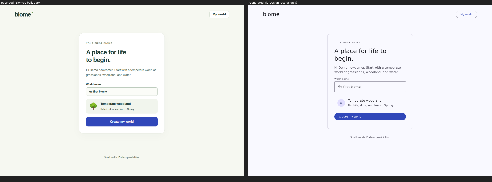
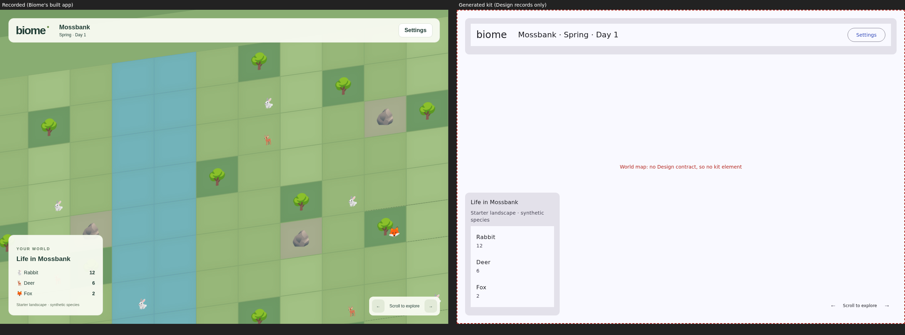

# Kit fidelity spike (W-29 #1, G3)

**Question:** can a kit generated from a project's Design records alone match the app's recorded screens?

**Method:**
1. `generate-kit.mjs` turns a Design revision (token set and component contracts) into one framework-free `out/kit.js`.
   - Tokens become CSS variables through `src/design-tokens.js` `tokenVariables`, the same function the generated app's styles use.
   - Each contract becomes a custom element `kit-<name>`. Its props are attributes, and its look is drawn from its preview kind with the tokens its anatomy names.
2. `pages/setup.html` and `pages/world.html` rebuild Biome's recorded screens (`docs/evidence/biome-review/initial-setup.png`, `populated-biome.png`) from kit elements and plain layout only. They add no custom styling of the look.
3. `capture.mjs` screenshots them beside the recorded ones at 1280 and 390 px. It also lists any tag the kit doesn't define (`shots/report.json`).

Rerun: `node generate-kit.mjs [design.json] && node capture.mjs`.

**Input (limitation):** Biome's own Design records aren't reachable from the item container, so the owner was asked on #1. The stand-in is the Aludel template seed with the sleek-saas Look. These are this project's records, unchanged since seeding. Biome's primary colour on screen (#2f45b8) matches sleek-saas's accent (#3047b9), so Biome most likely started from the same records. If Biome's records were edited, rerun with the export. Only the colour, type and shape rows below could change.

## Result

| Aspect | Recorded (Biome's build) | Generated kit | Kind of divergence |
|---|---|---|---|
| Structure: header, card, field, option, main button, footer | Present | Present, same order and layout | **Matches** |
| Primary colour | #2f45b8 | #3047b9 | **Matches** |
| Surfaces and ink | Warm off-white #f6f6f0, dark green ink #1d3a2b, green accent dot | Accent-tinted neutral (lavender-white), neutral ink | Code styles the app beyond its tokens |
| Type | Helvetica-like, weight 800, tight tracking on headings; bold field label and value | Material roles at weight 400 to 500 (Inter, falling back to system sans) | Same |
| Shape | Button and field corner 12, card corner 24 | Button corner.full (pill), field corner.extra-small, card corner.medium (as the contracts' anatomy says) | Code's shapes don't follow the contracts' anatomy |
| Field | Label above, pale filled box | Outlined Material field | Same |
| Option tile ("Temperate woodland") | Selectable tile on a soft fill | Closest contract is List item; not a selectable tile | **No contract** |
| Eyebrow text, wordmark with dot | Present | Plain text (no type role or brand mark for it) | **No contract** |
| World map, species counts (label and value row), scroll control | Present | Map has no element (dashed placeholder); counts fall back to a list with value as supporting text; the scroll control is two icon buttons | **No contract** (map); **contract too thin** (counts) |
| Container components (List, Nav list, Navigation bar, Page scaffold) in the demos | n/a | Empty, because the contracts give no example children for their slots | **Contract too thin for a demo** |

All pages ran without script errors. `kit-world-map` is the only undefined tag.

## Verdict

**The generator is not the problem: the records are.**
- A kit generated from Design's records reproduces the records faithfully: every seeded contract draws, and the screen's structure rebuilds from them.
- It doesn't match Biome's screens, because Biome's look lives in its code, not in its Design records. Its colours, type and shapes were written into the app's styles. Its app-specific components (option tile, world map, stat row) were never contracts.
- Generating from contracts therefore works as DEC-070 intends only once Design holds the look. The divergence is exactly the drift DEC-070 (2) asks Code's binding to surface.

**What #2's kit contract and binding need, from this spike:**
1. **Contract additions:**
   - Separate *demo content* from *defaults*: text and boolean defaults were leaking into real elements (fixed in the spike).
   - Example children for slots, so container components can demo.
   - For an app-specific component with no preview kind, an optional HTML template in the contract. Otherwise the kit can't draw the world map or the option tile.
2. **Binding drift should be measured, not just declared:**
   - Comparing a bound Code component's computed styles with its kit element's (colour roles, type role, corner) gives the "assessed" state evidence.
   - "Adopt" writes the code's values back into Design's tokens or anatomy. That is the path for existing apps like Biome, and it respects DEC-070 (1): the kit is still generated from records, and adoption updates the records.
3. **Generated apps should consume the tokens, so new apps don't drift on day one.** *Inferred, unverified:* Biome's surfaces and type were hand-written by its building agent, because the scaffold's token styles were available but not required. Checking Biome's code (not reachable here) would confirm or reverse this.

**What could reverse this:** Biome's actual records. If they already hold the cream surfaces, the bold type and the corners, then the generator (not the records) loses fidelity, and #4 must close that gap first.
