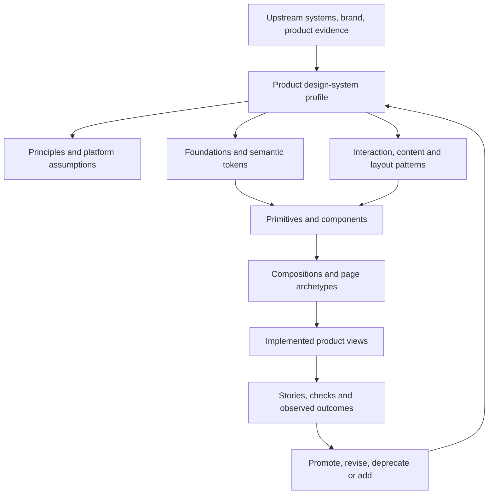

# Product-owned design systems through a shared contract

## Purpose

Aludel must be able to work with any justified visual and interaction language: a mature public system, a client's established library, an adapted brand system, or a new direction. It should make those systems inspectable and maintainable without flattening them into one universal house style.

The shared asset is the **process and contract**. Every product owns its actual system and releases it with the product.

## What counts as a design system

A design system is the versioned relationship among:

1. **intent and principles** — who the experience serves, how it should feel, and the tradeoffs it makes;
2. **foundations** — accessibility baseline, content voice, typography, color, spacing, shape, elevation, imagery, iconography and motion;
3. **interaction and layout patterns** — navigation, selection, disclosure, validation, feedback, recovery and adaptive composition;
4. **tokens and assets** — portable decisions, aliases, fonts, icons and other governed resources;
5. **primitives and components** — reusable semantic behavior and its visual expression;
6. **compositions and page archetypes** — repeatable assemblies that express the product's information architecture;
7. **evidence and governance** — stories, tests, research, maturity, ownership, releases, deviations, deprecations and migration.

Tokens without principles cannot explain what to build. Components without patterns cannot explain how to assemble a journey. A Figma library without executable behavior cannot establish implementation truth. A code library without usage guidance cannot establish design intent.

## Shared contract, project-owned realization

Aludel is a project within itself, not a separate category above client products. The [product-system framework](../product-system-framework.md) defines shared structures and per-project allocations. This document's intake/evolution contract is reusable; MD3, Angular Material candidates, actual tokens and portal patterns belong only to Aludel until another project explicitly adopts a revision.

For a new system or substantial redesign, start with user intent and stories, derive principles and interaction/layout patterns, and then compare compositions. Existing wireframes provide scenarios and observed learning; their containers, page boundaries and grouping are not automatically accepted. DEC-021 reopens those choices here. Record which product invariants remain authoritative and which UI hypotheses require fresh review.

## System-of-systems model



Products do not import a global portal theme. They receive a design-system profile, exact source revisions, applicable contracts and implementation assets from their own repository. The portal may later index these records, but it does not become the editable source of truth for product code.

## Intake modes

| Mode | Starting evidence | Required treatment |
|---|---|---|
| Adopt | Named system and version, such as Material 3 | Preserve upstream principles and contracts; record platform/library selection and unsupported areas |
| Adapt | Named system plus requested changes | Classify each change as token, component, pattern or principle deviation; test the affected consumers and upgrade path |
| Translate | Existing app, Figma library, brand guide or component code | Inventory actual rules; separate observed facts from inferred conventions; reconcile design/code drift |
| Originate | Product intent without a usable system | Research audience and experience qualities; compare reference systems; create the minimum foundations and assets needed for one slice |

Mixed inputs are normal. The profile identifies authority per layer instead of pretending the sources agree.

## Implementation-fit intake

A named design language does not select a package or prove its conformance. Record the language/specification, implementation library, supported revision, maintenance status and gaps separately. When an owner supplies a direction, narrow evaluation to implementing that direction; reopen unrelated foundations only for a demonstrated gap. Use public theme/extension APIs and product-level compositions; avoid universal wrappers that merely duplicate every upstream primitive. Exercise a small theme propagation and component substitution before making portability claims. The [MD3 landscape review](../evidence/d-01f-md3-landscape.md) applied the source distinction and caught MD2/MD3 and maintenance gaps; runtime and migration benefits remain untested.

## Source and deviation ledger

For each source record:

- stable name, type, owner, URL/path, version or digest, license and access date;
- which layers it governs;
- accepted scope and known gaps;
- update/recheck trigger.

For each deviation record:

- upstream rule or asset;
- product need and evidence;
- local replacement or modification;
- affected tokens, components, patterns and views;
- compatibility and migration consequence;
- approver, revision and recheck trigger.

An upstream update never silently overwrites local decisions. The update produces an impact report and a new product-system revision.

## Assembly philosophy

A page starts with a user situation, page responsibility and content hierarchy. The agent then:

1. selects an accepted page archetype or records why none fits;
2. selects interaction and layout patterns for the required behavior;
3. inventories stable and incubating components that implement those patterns;
4. composes those assets with product content and data;
5. extends an asset only when the existing contract nearly fits;
6. proposes a new asset only after recording the unmet need and checking the catalog;
7. validates the assembled journey, not only isolated pieces.

No page should introduce a new visual value when a semantic token exists. No page should recreate an existing component's behavior. Raw native HTML is encouraged inside a component when it is the correct semantic primitive; scattered page-local controls are not an acceptable substitute for a reusable contract. Disposable research prototypes may be exempt when clearly labeled and prevented from becoming implementation source.

## Token model

Use DTCG-compatible JSON as the exchange format unless a product-specific tool trial disproves it.

```text
reference value → semantic role → optional component decision → rendered asset
```

- Reference names describe what a value is.
- Semantic names describe why the product uses it.
- Component tokens are added sparingly when a stable component decision cannot be expressed through semantic roles.
- Modes represent intentional contexts such as light/dark, compact/comfortable or reduced motion; they are not duplicate token sets maintained by hand.
- Descriptions, source provenance and deprecation metadata are required for agent-facing tokens.

Generated platform values are build artifacts. The product-owned token source is authoritative.

## Pattern contract

Each interaction or layout pattern defines:

- user problem and context;
- when to use and when not to use it;
- sequence and state transitions;
- information and action priority;
- content rules;
- responsive/adaptive behavior;
- accessibility and input behavior;
- components that implement it;
- examples, counterexamples and outcome evidence.

Patterns such as confirmation, blocked work, stale evidence and uncertain external effect can span several components. Keeping them explicit prevents component reuse from producing an incoherent workflow.

## Deliberate interaction placement

Use the [placement procedure](process/interaction-placement.md) to choose directly visible content, disclosure, supporting panes, modal subtasks or separate destinations. Record the user task, consequence, independent identity, context/return, draft/focus handling, cardinality and narrow behavior before choosing a component. The procedure is shared; choices are project-specific. A preferred list-detail layout on one view does not approve it elsewhere. The [portal v2 application](portal-system/v2/interaction-contract.md) demonstrates this reasoning for a multi-decision Overview; executable behavior remains untested.

## Component contract and maturity

Every reusable component records:

- purpose, owning pattern and user need;
- anatomy and semantic structure;
- inputs, outputs, variants and slots;
- default, hover, focus, active, selected, disabled, loading, empty, error, stale and permission states as applicable;
- keyboard, focus, pointer and assistive-technology behavior;
- content, truncation, localization and responsive rules;
- semantic/component token usage and supported modes;
- source system and deviations;
- stories, checks, known gaps and consumers;
- owner, maturity, version, deprecation and migration.

Maturity is `proposed`, `incubating`, `stable` or `deprecated`.

- **Proposed:** gap and intended contract exist; no consumer promise.
- **Incubating:** bounded consumers may use it; missing evidence is visible.
- **Stable:** contract, representative states, accessibility checks, documentation and migration expectations pass.
- **Deprecated:** replacement and migration path exist; removal is versioned.

## Change workflow

1. Identify the product/user gap and affected system layer.
2. Check whether a token, pattern, component or composition already solves it.
3. Choose local use, configuration, extension, new asset or upstream contribution.
4. Write the smallest contract and representative stories that expose the change.
5. Check semantics, behavior, visual modes, responsive states and known consumers.
6. Review the exact system revision and impact report.
7. Promote maturity and release with migration notes.
8. Measure product outcome and system health; revise when evidence warrants it.

A feature and a system asset may be developed together, but their acceptance remains separate. Shipping one product use does not automatically make an asset stable for all uses.

## Agent context and enforcement

Each implementation task receives:

- product design-system revision;
- applicable principles and patterns;
- exact component contracts/stories and token names;
- catalog search result and known gap;
- allowed system changes and required review;
- affected-consumer list and required checks.

The implementation check should fail or require an explicit recorded exception when a page adds raw visual literals, duplicates catalog behavior, imports an unapproved UI dependency, or consumes a deprecated asset. Static rules are guardrails; human review still judges whether reuse serves the experience.

## Tooling boundary

Use the maintained [tool ecosystem registry](../tool-ecosystem.md) to fill capabilities instead of creating a bespoke workshop, token compiler, canvas or visual-review service. Tool outputs remain evidence tied to an exact design-system and build revision; they do not become new authorities for product intent.

The current preferred component boundary is source-controlled stories rendered through Storybook, with its preview MCP evaluated as an optional agent adapter. The same stories must remain usable through ordinary repository commands if that adapter changes. Integrated application behavior stays in the real app and its browser tests. Figma and hosted visual review are conditional integrations, not prerequisites for products that do not use them.

## Evaluation dashboard

Track catalog coverage, reuse and escape rates, duplicate patterns, state/story completeness, accessibility results, unexplained visual drift, propagation cost, change lead time and affected user outcomes. Compare by change class and system revision. Never reward reuse or component count without outcome evidence.

## Current portal application

Aludel's historical interaction wireframes are evidence, not its design system or a binding layout. DEC-021 reopens composition and interaction grouping; current view intents retain the underlying product semantics. DEC-020 focuses the portal's next foundation packet on MD3 implementation fit. It must prove one representative slice and produce:

- accepted experience principles and platform assumptions;
- selected upstream/behavior foundation with version and license;
- initial semantic token model and modes;
- minimum pattern/component catalog for Overview, task and review;
- one narrow/wide vertical-slice proof with stories and accessibility evidence;
- deviation, maturity and measurement rules;
- an owner review record.

Only then may D-01E turn the preferred dark operational character into representative visual compositions. Production implementation still requires the M0 phase transition.
