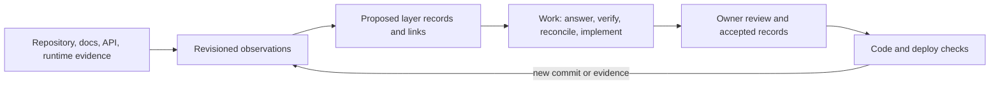

# Bring an existing project into Aludel

## Authorization and outcome

**Owner instruction (chat, 2026-09-27):** plan how a user can connect an existing, possibly undocumented and differently structured system, reconstruct useful layers from code and other evidence, manage Aludel inside itself, bring Launch LMS into the ecosystem, and continue detecting and resolving changes made outside Aludel. This authorizes this local planning record and read-only inspection of the available repositories under DEC-029. It does not authorize importing either project into the live portal, modifying Launch LMS, running agents, deploying, spending, or writing to GitHub.

**Desired outcome:** project creation can start with an existing repository. The owner can see what was observed, what was inferred, what is missing, and what needs judgment. Once connected, new commits and new evidence go through the same Work and review system. The project continues to run without Aludel.

This is a proposed plan, not an accepted design or implementation. Keep `WORK-AGENTS-01` as `next_action` until the owner selects otherwise; do not silently displace its review and recovery work.

## Process finding and applied improvement

The current forward chain assumes intent and layer records precede generated code. Reverse reconstruction cannot use a code link as proof of intent or owner acceptance. For every proposed imported record, use an **evidence ledger** with: project and immutable source revision; source location; direct observation; proposed interpretation; confidence; competing explanation; affected layer/record; reviewer; and disposition (`unreviewed`, `accepted`, `rejected`, `superseded`). Keep raw evidence independently retrievable. Repeated scans update the observation at a new revision; they do not silently overwrite accepted intent.

**Applied to this plan:**

| Pinned evidence | Direct observation | Hypothesis / limit | Next check |
|---|---|---|---|
| Aludel `apps/portal/server/code-links.mjs`, inspected 2026-09-27 | Indexing is limited to `src`, `server`, `tests`, JavaScript/TypeScript, selected entry files, generated manifests, `Aludel-Work`/`Implements` trailers, and test names. Revision changes can make links suspect and create Reconcile work. | Its unit model can be extended, but “untraced” means only “no link within this index”; its reachability cannot establish dead code in another stack. | Run coverage fixtures on Aludel and one Launch LMS slice before defining generic Code health labels. |
| Local `../launch-lms` at `518bb33fae625721ca26bf61b2ac286bc6146db5`, inspected 2026-09-27 | It contains `apps/web/package.json`, `apps/api/pyproject.toml`, Dockerfiles, `AGENTS.md`, and product/design/quality documentation directories. | This project is not code-only; existing documents and the separate infra repository must be inventoried before reconstructing stories or deploy settings. Presence does not establish that any document is current or accepted. | Pin a complete source inventory, read selected docs, and compare a bounded route/API slice with them. |

**Observed result:** the ledger separated two facts from their interpretations and exposed the first adapter and document-inventory gaps. It has not yet been tested in the portal or with owner review. The proposed process is effective only if the first vertical slice catches a wrong inference before it becomes accepted knowledge.

## Product model

### One workflow, multiple directions

Connection starts as a **source inventory**, then produces reviewable hypotheses in the normal layers. The same machinery runs later against a new commit, a newly supplied document, a changed API description, or an observed runtime behavior. There is no permanent “import mode” or separate class of work items.

The core distinction is **observed behavior versus intended behavior**. A route, table, screen, or test can support a claim that something exists; it cannot alone establish why it exists, who needs it, whether it is correct, or whether an absent flow is required. Vision claims need a person or independent product evidence. Imported historical documents remain sources; importing them must not fabricate prior authorization, execution, review, or acceptance.

### Layer destinations and ordinary actions

| Evidence / gap | Proposed destination | Work action and review question |
|---|---|---|
| Existing product docs, research, decisions | Library sources/findings; Vision claim drafts | `vision.review`: is this still the intended problem, audience, principle, or outcome? |
| Routes, navigation, screenshots, UI states | Pages Map/Page/Flow drafts and Design component inventory | `pages.review` or `design.review`: is the inferred journey complete, and which variants are intentional? |
| Schemas, migrations, handlers, API specs and tests | Data object, operation and access drafts | `data.review`: which contracts are public/required; do tests reflect current behavior? |
| Symbols, dependencies, tests, build files, ADRs | Code Overview/Explorer/Tests/Docs and trace links | `code.reconcile` / `code.review`: which units implement a confirmed record; is an unlinked unit expected? |
| Dockerfiles, Compose, CI, environment examples, infra manifests | Deploy environment/integration proposals | `deploy.review`: which environment and service contract is authoritative? No credential values enter the inventory. |
| Missing required flow, undocumented behavior, conflicting docs, inconsistent component usage | Work item linked to exact evidence and affected layer | Clarify intent, document accepted behavior, implement missing behavior, or accept a deliberate exception. |

These action names are design proposals. Reuse existing role actions where their contract fits; add new actions only after checking `config/roles.json` and WORK-AGENTS-01's action-neutral runner. A routine can schedule inventory or drift checks and stage findings. A routine never authorizes a coding run, rewrites Vision, or accepts its own findings.

### Reconciliation after external changes

At a pinned new commit, compute the diff from the last inspected commit; rescan affected units plus dependency/route/schema edges; compare observed facts with accepted layer revisions and existing trace links. Show a single reviewable change set with independent dispositions:

1. **Consistent:** update observation and link revision; no task if nothing requires judgment.
2. **Unlinked or changed behavior:** propose a Code/Pages/Data/Design/Deploy reconciliation item with the exact diff, likely affected records, tests, and confidence. Let the owner choose to preserve the code and revise upstream intent, change code back, or mark it an intentional exception.
3. **Missing expected behavior:** distinguish a documented requirement with no implementation from a mere missing inference. Only the former becomes a candidate implementation task without first asking what is intended.
4. **Conflict or low confidence:** retain both claims, ask a bounded question, and block only dependent work.

Detected code is never treated as automatically approved product change. Changed link coverage or an unrecognized route is a finding, not proof of a regression. Accepted decisions link both the observed commit and the resulting record revision, so later scans can distinguish an intentional exception from recurring drift.

## Layer-app discovery consequence (owner refinement, 2026-09-27)

The owner extended the [general layer framework](../layer-framework/work-record.md): each domain should discover useful neighboring outputs, maintain its own relation/coverage policy, audit its output quality, and propose Work when coverage changes. Existing-project reconstruction is therefore a strong first test. With Code present and Pages empty, Pages can inspect pinned route/screen observations and propose a policy for when an observed frontend path warrants a Pages flow. It must ask where the intended journey is ambiguous and preserve observation separately from accepted intent. The same policy later handles a new route or a disconnected Code source; no special one-time import rule should be needed. EX-01 should define source/capability discovery and policy provenance; EX-03 should test a wrong correspondence; EX-04 should stage deduplicated gaps through Work. This refines the proposed plan, not its authorization or readiness.

## Proposed delivery packets and gates

| Packet | Scope and output | Exit evidence / dependency |
|---|---|---|
| **EX-01: evidence and authority contract** | Define source types, immutable revision/location anchors, observation vs hypothesis vs accepted intent, confidence/disposition, duplicate handling, source conflict rules, and the owner review path. Decide whether project knowledge is in the companion repository or an exportable store with equivalent round-trip behavior. | Two hand-written ledgers: one Aludel slice, one Launch LMS slice. Owner can reject a wrong inference without losing its source. Depends on PP-01C's repository and knowledge-authority decision; can research before that decision. |
| **EX-02: read-only repository inventory** | Connect an existing owner-selected repo or local checkout at a pinned commit; inventory manifests, docs, routes, APIs, schemas, tests, build/deploy files and repo relationships. Include extra user-supplied sources later without forcing them into the code repo. Show parser coverage and unsupported languages. | Idempotent rescan; no app or repo mutation; inventories both Aludel and a bounded Launch LMS slice; unknowns visible. Requires repo ownership and read permissions. |
| **EX-03: one vertical reconstruction slice** | In Aludel first, propose one real user flow from page/route through API/data to tests, then attach its existing docs and accepted Vision evidence. Repeat on one Launch LMS flow with its actual docs; build stack-specific extractor adapters only as needed. | Source-linked page, flow, operation, object, code and tests; reviewer corrects at least one deliberately wrong hypothesis; no inferred Vision claim is promoted without product evidence. This is the first real test of the ledger. |
| **EX-04: natural Work integration** | Surface questions, missing required flows, unlinked code, conflicting docs, design-system variants and refactor opportunities through existing item/run/review contracts. Add a bounded routine for rescans. | A Work item carries pinned inputs, scoped action, proposed output, checks and a human disposition; stale input and retry behavior proven without starting unauthorized code work. Depends on WORK-AGENTS-01. |
| **EX-05: ongoing drift** | Observe new commits on a connected repo; compare accepted records and trace links; propose upstream revision, code correction, exception, or no action. Handle force-push, missing base, renamed units, generated/vendor code and partial parser coverage. | Fixture and live local branch trials: an outside commit that changes behavior, a harmless refactor, a new route and a rejected finding. No automatic overwrite or duplicate items. Requires EX-01–04. |
| **EX-06: deploy adaptation** | Read the project's own build/environment declaration; model services, migrations, check commands and independent app/infra repositories. Introduce runtime adapters for Launch LMS only after an isolated local proof. | A preview can use the project's declared contract in a contained environment, with health, exact source/build identities and recovery evidence. No production import or deployment implied. Depends on PP-01D/E and explicit owner authorization for any live external effect. |
| **EX-07: self-host and Launch LMS expansion** | Bring Aludel's existing knowledge into its own layers (extend LAY-06), then expand the Launch LMS slice gradually, reconciling its documentation and infra repository rather than replacing either. | Owner-reviewed layer coverage, remaining gaps and exclusions; clean export/round trip; original applications keep running. Requires the earlier gates; does not declare LAY-06 complete solely from document searchability. |

## Readiness and open decisions

- **Ready now:** EX-01 research and a read-only, pinned slice inventory. The current request authorizes this plan, not a live import. This packet is a candidate after current WORK-AGENTS-01 priorities; it does not become `next_action` by being written.
- **Needs groundwork:** exact source-of-truth and sync decision in PLATFORM-PIPELINE-01; read-only connection and project identity; WORK-AGENTS-01 action coverage; app-defined runtime and guard work before EX-06.
- **Owner judgment before product design or implementation:** Which Launch LMS flow best demonstrates value; whether an inferred record can be marked “accepted from evidence” without the owner explicitly reviewing its meaning (recommend no); and whether code-first onboarding should wait for GitHub connection or also accept a local checkout/archive. Default for a bounded prototype: read-only local checkout at a pinned commit.

## Planning retrospective

1. **Harder than necessary:** the existing forward trace system and the Launch LMS reference case study could easily be mistaken for general import support; the local checkout already contains docs despite the code-heavy premise.
2. **Preparation for next time:** use the evidence ledger and pin source revisions before generating records. Inventory *all* supplied sources, not only code.
3. **Roadmap effect:** add an existing-project path that cuts across LAY-06, PLATFORM-PIPELINE-01 and WORK-AGENTS-01; avoid a separate permanent import workflow.
4. **Open questions:** knowledge authority/sync blocks durable imported records; source access and first flow choice shape the prototype; deployment adapters wait for app-defined environment contracts.
5. **Process change and test:** the ledger was applied to two local facts above and separated observation from hypothesis. Owner correction in EX-03 and repeat scans in EX-05 are still predictions, not observed proof.
