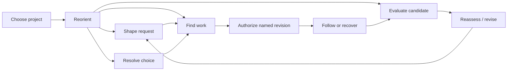

# View intents before inherited pages

DEC-021 reopens the previous compositions and interaction grouping. D-01D/D-01B are historical wireframe and scenario evidence. Neither the three-card Overview nor the old page boundaries are specifications for the new system. Start from the [product](../../../product.md), its owner jobs and [BorrowBox fixture](../../demo-app/borrowbox.md).

## What survives the reset

The owner manages several projects; work is durable before execution; a recorded decision does not itself authorize work; authorization names the task revision and permitted effects; uncertainty is not success; reviews identify immutable candidates; acceptance is separate from release; changes preserve history and mark affected inputs stale; managed apps remain independent.

These are product/domain constraints. Exact landing pages, card groups, columns, detail-pane boundaries, labels and destinations are design hypotheses. Project context must remain legible, but project-first navigation is a starting hypothesis that may be reconsidered with evidence. A historical statement that a path was usable does not approve its new expression.

## Intent and story map

These are view responsibilities, not an instruction to create nine routes.

| ID / owner situation | Question and success | Required information/action | MD3-informed composition hypothesis | Exclusion / key uncertainty |
|---|---|---|---|---|
| V01 Choose a project | Where should I spend attention? Correct project opened with its objective understood | Project identity, outcome, actionable exception or review, last known currency | Comparable list; project details may use list-detail on wide screens | No portfolio KPI dashboard; cross-project workflow still outside initial proof |
| V02 Reorient within a project | What matters now, why, and what can I do? Owner chooses a useful next step without reconstructing history | Current outcome, consequential attention, latest usable result, quiet work summary, request entry | Compare attention list-detail, outcome briefing and focused next-action approaches | No mandated three cards; zero decisions never implies milestone complete |
| V03 Shape a request | Did the system retain what I mean? Owner can revise and save a durable intent | Original wording, interpretation, criteria, consequential unknowns | Focused document/form, supporting context only where needed | Saving does not run; failed save preserves text |
| V04 Resolve a choice | What changes with this answer? Owner selects deliberately and sees affected work | Question, alternatives, recommendation/rationale, consequence, explicit commit | Structured choice form; readable impact summary adjacent or following | Not a generic chat reply; no silent execution or all-ready claim |
| V05 Find work | Which task is relevant and what is its condition? Owner opens a named record | Filter/scope, task identity, state, consequence, freshness | List-detail for browse-and-inspect; linkable task identity | No default Kanban requirement; collections must keep their scope |
| V06 Authorize a task | What am I allowing now? Owner can explain permitted effects and stop conditions | Exact revision, criteria, effects, boundary, expected artifact, commit | Focused task/action view with supporting intent; confirmation only where useful | Overview cannot hide authorization in a quick-action icon; Q-002 remains unresolved |
| V07 Follow or recover | What happened and is action needed? Waiting, failure and uncertain effects are distinguishable | Human-readable stage, evidence, safe next step, attempt history on demand | Status with a purposeful exception region; diagnostics in disclosure | No invented progress percentage; unknown effect blocks unsafe retry; Q-008 remains open |
| V08 Evaluate a candidate | Does this result meet intent? Owner can test and respond to one exact version | Brief/test tasks, actual preview, evidence/gaps, artifact currency, response | Primary result with supporting evaluation pane; contextual identity stays visible | Not a screenshot carousel; unavailable preview must not substitute a newer candidate; Q-005 open |
| V09 Reassess changed inputs | What changed and what remains valid? Owner locates current task and historical result | Changed revision, affected scope, prior evidence and path to reassessment | Comparison/document pattern with explicit current/historical state | No automatic reauthorization; preserve unsaved feedback |

## Relationships to test

These are semantic transitions; wide-screen panes may combine views without merging authority. Browser back, direct links, keyboard focus and returning to a filtered collection must work regardless of composition. Narrow layout changes the presentation of context, not the action's meaning.

## Overview experiment

User: the returning single owner. Goal: identify the highest-value next action while understanding the project outcome. Compare three organizations of the same information, not three palettes. Use 1440×1024 desktop concepts; the subsequent selected proof must include a narrow layout.

Shared synthetic state: BorrowBox's objective is “Members can reserve a tool for pickup.” BB-D01 asks whether available reservations are confirmed instantly or need volunteer approval; two tasks are affected. BB-001 implementation is blocked on this policy. BB-003 acceptance checks also depend on implementation evidence. BB-002 catalog descriptions is ready independently. No candidate exists yet; there is nothing to review. This is fixture evidence only. Date anchor: 2026-09-19.

| Concept | Organization / dominant next action | Why it might help | What could fail / narrow rule |
|---|---|---|---|
| Attention workspace | Prioritized attention list with a selected item's context in a detail pane; “Open decision” | Make choosing and inspecting consequential work the page's central job | Mixed record types may confuse; compact uses list → selected context with explicit back and named record link |
| Outcome briefing | Clear outcome heading, a concise explanation of the obstacle, one strong decision action, compact work rows beneath | Explain why a decision matters before asking the owner to process a queue | One highlighted issue may hide several; compact preserves outcome → issue → action → remaining work order |
| Focus and context | Spacious next-action region supported by a narrow project-context/work pane; “Open decision” | Reduce scanning while keeping the wider situation visible | Recommendation may feel opaque; show rationale and other attention items; compact puts supporting context after the focus |

All three retain a quiet “New request” entry and project destinations as an experimental common shell. They do not save decisions or authorize tasks from the Overview. All three must work later with no attention items, several blockers, a current candidate, stale evidence and unavailable counts. A new candidate's priority versus a blocking decision is a testable product rule, not a fixed library default.

## Owner review and next evidence

Review tasks: identify what BorrowBox is trying to achieve; find the decision preventing reservations; explain whether independent work can still proceed. Then evaluate which arrangement makes these answers clearest and feels appropriate to use daily. Selection accepts an Overview composition hypothesis only; navigation, narrow behavior, other views and MD3 implementation remain unaccepted until separately checked.

Static concepts provide visual/hierarchy evidence, not interaction or accessibility proof. Once selected, the D-01F workshop trial should exercise the chosen Overview pattern and one connected decision/task or review pattern. D-01E broadens the accepted system into the remaining views using their intents above.
