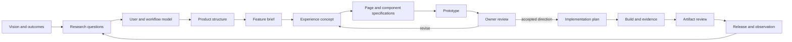

# Product development workflow

## Purpose

Aludel should turn an idea into a product through an inspectable chain of reasoning and artifacts. It must support both the products being built and the portal's own development. The portal should never ask an agent to jump directly from a feature sentence to page code unless the change is genuinely routine and already constrained by accepted patterns.

The process is recursive by design: the portal feature that helps create and review prototypes must itself be created and reviewed through this process.

## Current process gap and priority

Owner clarification (2026-09-19, DEC-014): improve how development work is discovered, sequenced, performed, and reviewed across projects. D-01B is evidence for that work, not the immediate deliverable to optimize. The artifact hierarchy below did not by itself prevent later prototypes from encoding unreviewed structure.

R-07C audited that gap and supplied the [operating procedure](process/operating-procedure.md), [work record](process/work-record-template.md), and [three manual applications](process/r-07c-dry-runs.md). Use the procedure to select and gate work; use the artifact guidance below to perform it. The [evidence report](../evidence/r-07c-process-validation.md) separates observed repository failures from inferred causes. This is a trial process; D-01D is its first live application.

Selection of one composition does not accept adjacent pages or navigation. An artifact's presence does not establish adequate contents, and technical checks do not establish product acceptance.

## Post-trial strategy — 2026-09-19

The [cross-iteration retrospective](../evidence/d-01-design-retrospective.md) records the first qualified positive usability feedback on v4, alongside rejected appearance. Continue the content-based readiness gate; additional document volume is not the remedy. Track structural clarity, interaction behavior, visual quality and technical correctness separately. A passing browser suite cannot establish any owner acceptance, and a usable experiment does not approve its styling for implementation.

For this portal, preserve the accepted structure and usable interaction baseline while R-08/D-01F establish the design-system strategy and portal foundation before D-01E resumes. The first D-01E image set mainly varied surface treatment and exposed the absence of principles, component contracts and change governance. Future low-fidelity experiments may still defer appearance, provided the follow-up is named before production styling is adopted. Evaluate the process through early gap detection, repeated defects and observed rework; general effectiveness and efficiency remain unproven.

The reusable policy is in the [design-system strategy](design-system-strategy.md). Standardize the intake and evolution contract, not one visual language across products. Before composing a page, identify the product's exact system revision, applicable principles, patterns and assets. Before implementation, reuse, compose or extend the catalog; a new component needs an explicit gap and maturity path. A disposable experiment may use local markup only when it is prevented from becoming production source.

Select supporting tools through the [capability registry](../tool-ecosystem.md). A component workshop can make states executable and reviewable, but it does not replace page/journey design or an integrated preview. Prefer its portable repository artifacts over a vendor-only review surface.

## The development chain

Each arrow is traceable. An artifact records which upstream revisions it used and what question it is meant to answer. “Accepted” means accepted for the next stage, not permanently frozen.

## Artifact hierarchy

### Product level

| Artifact | What it establishes |
|---|---|
| Vision | The change in the world the product is trying to make |
| Outcomes and measures | How we would recognize useful progress |
| Users, actors, and contexts | Who acts, what they need, and relevant constraints |
| Experience principles | Durable qualities that should shape decisions |
| Product map | Major areas, capabilities, and their relationships |
| Roadmap hypotheses | The smallest sequence that tests the riskiest assumptions |

### Product-area level

| Artifact | What it establishes |
|---|---|
| Journey or service blueprint | How an outcome spans stages, actors, systems, and handoffs |
| Information architecture | Where information and actions live and how people find them |
| Domain model | Records, relationships, ownership, and lifecycle |
| Design-system profile | Product-owned sources, principles, foundations, patterns, assets, deviations and governance |
| Pattern inventory | Repeated interaction approaches already available |
| Research findings | Observations, sources, confidence, and implications |

### Feature level

| Artifact | What it establishes |
|---|---|
| Feature brief | Problem, outcome, audience, scope, exclusions, and success signals |
| Story/scenario map | Concrete user situations, paths, and exceptional states |
| Assumption and question log | What is known, inferred, or still risky |
| Inspiration board | Referenced products, screenshots, sketches, generated concepts, and the specific quality being borrowed or rejected |
| Experience concept | A verbal model of how the feature should work and feel |
| Content model | Meaning, hierarchy, terminology, and required content before layout |
| View map | Pages, overlays, entry/exit paths, and responsibilities |

### View and component level

| Artifact | What it establishes |
|---|---|
| View brief | Purpose, audience state, entry, primary action, information hierarchy, exits, responsive behavior, and required states |
| Loose composition | Boxes/arrows, sketch, or generated image exploring hierarchy without production code |
| Component contract | Purpose, anatomy, inputs, variants, behavior, content rules, accessibility, and states |
| State matrix | Empty, loading, partial, success, error, stale, permission, offline, and other relevant states |
| Interaction prototype | Only the behavior needed to answer named research questions |
| Component stories | Isolated implemented states used for documentation and later tests |

### Delivery level

| Artifact | What it establishes |
|---|---|
| Implementation specification | Accepted behavior mapped to components, data, APIs, and migrations |
| Task and authorization | Bounded work, inputs, permitted effects, and stop conditions |
| Build artifact | Exact source/build identity and runtime result |
| Evaluation | Acceptance examples, automated checks, human review, gaps, and confidence |
| Release and observation | What became live, recovery path, behavior observed, and follow-up candidates |

## Proportional artifact policy

Granularity follows novelty and risk, not ceremony.

| Change class | Minimum design trail |
|---|---|
| Reuse an accepted component without behavior change | One-sentence intent, selected component/story, acceptance example |
| Small component or content change | Short component note, affected states, before/after example |
| New reusable component | Component contract, state matrix, at least two alternatives or references, isolated stories |
| New or materially changed page | Feature brief, page brief, content hierarchy, view map, loose composition, key states, review task |
| New product area or cross-stage workflow | Research questions/findings, journey, information architecture, feature decomposition, multiple concepts, staged prototype plan |
| High-risk external effect or release flow | All relevant above plus authorization, failure/recovery model, and operational evidence |

The portal should recommend the artifact set from this classification and allow the owner to add or waive an artifact with a recorded reason. Agents may create lightweight artifacts autonomously; they should ask for owner judgment at consequential product forks.

## Shared structure and recursive project use

Use the [product-system framework](../product-system-framework.md) for capability, authority and evidence coverage. Its contract applies to all projects, including Aludel. Product intent, selected design language, implementation libraries and tool allocations remain project-specific. Shared resources require explicit versioned adoption; no generated product inherits the portal's stack by default.

Before a system change or major redesign, classify existing evidence into enduring product constraints, historical learning and presentation choices open to reconsideration. Start from user jobs and stories, then system philosophy and patterns, then compositions, then components/tokens. “Usable” wireframe evidence does not canonize its card grouping or page boundaries. DEC-021 applies this reset to the portal; [current intents](portal-system/v1/view-intents.md) supersede reliance on old page composition.

## Designing a view

A major view such as Project Overview should not begin as JavaScript. Its sequence is:

1. **Write the view brief.** State who arrives, what they need to know or do, the primary action, and what the page explicitly does not own.
2. **Inventory content.** List required concepts and rank them before choosing cards, columns, or navigation.
3. **Check the design system.** Load the exact profile revision; inventory applicable page archetypes, patterns, components and gaps. Do not silently invent a parallel style or control.
4. **Collect references.** Capture a small number of external examples or existing internal patterns. For every reference, record what quality is relevant; avoid copying an unexplained screenshot.
5. **Explore compositions.** Produce two or three rough alternatives as text diagrams, sketches, or generated images. Preserve prompts, inputs, and provenance for generated concepts.
6. **Choose a direction.** Compare alternatives against the feature brief and research questions. Record the reason; owner review is required when the choice materially shapes the product.
7. **Specify states and behavior.** Apply the [interaction-placement procedure](process/interaction-placement.md): justify visible content, expansion, pane, dialog or navigation; define URL/back, draft/focus, zero/one/many/unknown states, failure/staleness, responsive priorities and component responsibilities.
8. **Prototype only what remains uncertain.** Use the cheapest fidelity that answers the question. A static image can test hierarchy; a code prototype can test navigation or interaction.
9. **Review with a script.** State the original intent, what is represented, what is fake, tasks to try, and evaluation questions.
10. **Translate accepted direction.** Create implementation specifications and component stories against the selected system revision. Route genuine gaps through the component-change process; do not promote prototype code automatically.

## Designing a component

The review sidebar from D-01B is a useful example. Before implementation it needs:

- **Purpose:** keep the reviewer oriented without pretending to be part of the product under review.
- **Context:** external review harness surrounding a bounded artifact.
- **Anatomy:** original intent, scope, test tasks, evaluation questions, simulation boundary, optional scenario selector.
- **Content rules:** short enough to scan; instructions phrased as outcomes; technical controls explicitly labeled as harness controls.
- **Behavior:** persistent on large screens, preceding the prototype on small screens, collapsible only if the task remains available.
- **States:** first visit, task completed, alternate scenario, obsolete prototype, and missing review specification.
- **Alternatives:** separate landing page, persistent sidebar, or floating guide; compare distraction, available width, and recoverability.
- **Evidence:** owner can begin the correct path without repository context and can state what is being evaluated.

This can be a paragraph for a trivial review. It becomes a full component contract only if the pattern proves reusable.

Reusable assets also record source-system provenance, semantic token usage, maturity, consumers and migration. Use the [design-system profile template](process/design-system-profile-template.md) for new systems and the component contract in the [design-system strategy](design-system-strategy.md) when a feature exposes a catalog gap.

## Visual exploration and generated images

Concept art is useful when layout, density, brand character, or spatial hierarchy is uncertain. It should be treated as a versioned design artifact with:

- source brief and view revision;
- references and their intended influence;
- prompt/model/tool or human author;
- creation time and supersession links;
- annotations explaining which ideas are under review;
- explicit statement that an image does not specify interaction, responsiveness, content completeness, or accessibility.

Generated imagery is optional. The decision depends on the question. A text diagram is often faster for information architecture; a generated image can make a major page direction tangible; an executable prototype is justified when behavior itself is uncertain.

## Review gates

| Gate | Reviewer decides | Required evidence |
|---|---|---|
| Problem framing | This is the right problem and outcome | Brief, current behavior/evidence, open questions |
| Experience direction | This model is worth detailing | Journey/view map, alternatives, tradeoffs |
| Visual direction | This hierarchy and character fit | Annotated compositions or concept images |
| Interaction direction | The important flow makes sense | Prototype, review script, observed findings |
| Implementation readiness | Agents can build without inventing product behavior | Accepted specs, states, data/API implications, acceptance examples |
| Artifact acceptance | This build satisfies the approved intent | Exact artifact, preview, checks, gaps, linked inputs |

The first four are design review. Artifact acceptance is implementation review. Combining all of them into one large prototype review makes feedback ambiguous.

## What changes for D-01B

D-01D resolved the broader structural gap: the owner selected project-workspace direction A, and the [readiness verdict](portal-foundation/v1/prototype-readiness.md) defines one bounded D-01B experiment. D-01B may resume within that scope. Use the accepted page and transition contracts plus the external review guide; the older Overview-only artifact checklist is not readiness for the full flow.

The existing prototype may be discarded rather than refined. No production decision depends on preserving it.

## Benchmark implications (R-07B)

The [workflow benchmark](../evidence/r-07b-workflow-benchmark.md) supports explicit design readiness, named component states, and feedback attached to a specific artifact. D-01D tested those concepts through loose alternatives; D-01B now tests their interaction behavior. External design and review links must identify the selected revision or captured export; a current URL alone is insufficient. Reuse specialist workshops and review surfaces rather than building their full editors into the portal. These remain research recommendations pending the interaction experiment.
