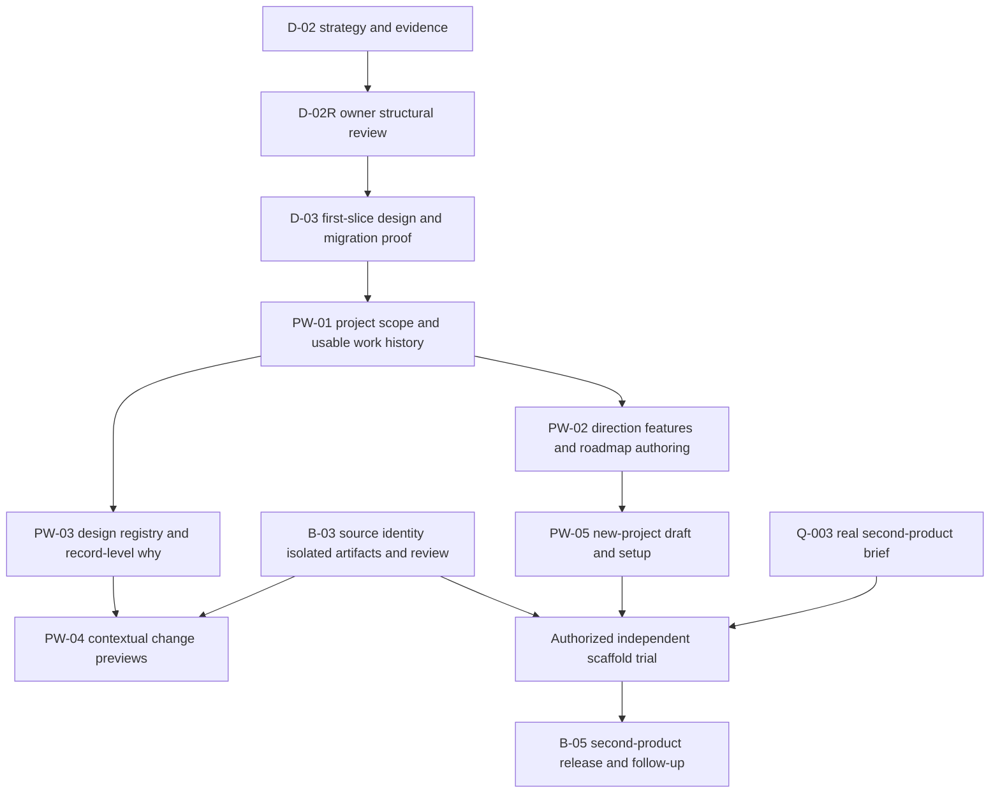

# Deliver useful slices without rebuilding the whole product at once

D-02 is the authorized strategy work. The packets below are proposed planning records, not authorized tasks. Each implementation slice needs current proposal/work authorization and its own readiness check. Work remains serial; the graph describes dependencies, not concurrent dispatch.

## Sequence and gates

Recommended serial order after review: D-03 → PW-01 → PW-02 → PW-05 draft/setup slice → PW-03. Reconcile B-03 scheduling at the first-slice review; PW-04 and real scaffold wait for its required evidence. The owner can reprioritize PW-03 before PW-05 if design discovery is more urgent; neither should delay the minimum real-preview B-03 loop indefinitely.

| Packet | Inputs / work / output | Required checks and reviewer | Stop/return condition |
|---|---|---|---|
| **D-02R — Select structure and first priority** | D-02 audit, alternatives, six walkthroughs, contracts; owner chooses A, B or revisions and first slice | Record exact decision revision, selected scope and open objections in portal | No implementation until consequential structure is selected; request revisions returns to D-02 |
| **D-03 — First-slice interaction and reconciliation proof** | Selected structure + accepted MD3; source inventory; design Work Plan/History collection/detail and reconciliation flow; lo-fi alternatives/states then bounded interaction proof as needed; disposable import rehearsal | Owner accepts relevant interaction; two-item route/reload/return, zero/missing/error/stale states; dry-run produces explainable B-01/B-02/B-03 mappings without invented history; verify rollback/backup strategy before real writes | Missing evidence, ambiguous historical completion or unknown target authority returns to reconciliation; no live bulk import |
| **PW-01 — Scoped product records and usable work history** | D-03 acceptance; add project-scoped domain/API boundary, plan entry revisions/provenance/relations, read-only source-backed history + planned entries, link real tasks; apply only reviewed bounded migration | Unit/domain project isolation, expected-version conflicts, duplicate/changed-source handling, transaction rollback; browser create/edit plan, two-entry selection, live task detail and evidence links; owner inspects B-02 history and B-03 plan | Fails if it is merely raw source rendering, cannot create a plan entry, or historical entries become executable |
| **PW-02 — Direction, features and roadmap authoring** | PW-01; scoped Product design; brief/outcome/milestone/feature/story revisions and views over same plan entries | Create from empty; no-op save; conflict retains draft; changing consumed requirement marks only dependents stale; roadmap priority does not authorize tasks; owner judges content hierarchy | Unclear product/domain boundaries return to design; no new execution scheduler |
| **PW-03 — Design registry and record-level rationale** | PW-01; current source/catalog reconciliation; scoped Design view/system/exploration design | Register assets and source revisions; image/story availability and selection scope; stable view/component usages and backlinks; rejected alternatives visible; missing “why” never invented | Real-time DOM inspector and build review remain PW-04/B-03; don't fork tokens/components into a portal-owned editor |
| **PW-04 — Contextual change previews** | PW-03 + B-03 identified source/artifact, isolation and review session; accepted inspect/compare interaction | Baseline/candidate navigation, changed-view focus, exact input rationale, unmapped/renamed keys, forged/cross-project messages rejected, keyboard equivalent, reset preserves notes, unavailable artifact, stale acceptance | No live candidate execution in trusted portal origin; no claim from a mock inspector; B-03 blocking gaps return to B-03 |
| **PW-05 — New-project draft and setup plan** | PW-01 project boundary + PW-02 authoring; scoped progressive project-creation design | Idempotent draft creation; project switching/draft retention; two projects with colliding local record keys; explicit stack/system/shared recipe; capability gaps; no provider effect on save | A draft is not a built app; unknown choices stay visible; scaffold gets separate work authorization and B-03 prerequisites |
| **B-03 remaining — real run and immutable review** | Existing R-03/R-05/R-06 and B-03A owner-cycle findings; preserve ADR-008 reuse assessment | Source/PR readiness, worker transport/leases/recovery, identified artifacts/context, isolated review/checks/annotations; Q-005/Q-008 resolved when needed | D-02 does not replace this with manual-only execution; no unattended runner just because a planning record exists |
| **B-05 — real second product proof** | Owner brief Q-003, PW-05, B-03; existing B-04 release/recovery prerequisites for live delivery | Independent app/repository/runtime and project isolation; observation → decision → reviewed fix; measure real lead time | Fictional BorrowBox and portal record creation do not pass M3 |

## First vertical slice: PW-01, not a new navbar

**Owner-visible result:** open Work / Plan or History, find B-02 completion and its actual evidence, see B-03's pending work, create/revise a new planning entry, and open the live strategy work with its real authorization history. A plan has a stable URL, meaning, source and relation to a milestone/task. Editing priority never starts execution. Existing proposal/decision/work deep links continue to resolve.

**Bounded migration:** begin with B-01, B-02, B-03A and B-03 remaining plan from their exact execution/status/evidence sources; include the D-02 real task linkage as live state, not invented historical state. Stage contradictions for review. Do not import all M0 packets, all decision rows, every prototype or every file in the first batch. New native plan creation proves this is a reusable product capability, not a hard-coded bootstrap report.

**Minimum proposed storage:** project-scoped plan identities/revisions; source assertions/migration mappings and applied manifest; typed plan→source, plan→task, plan→dependency relations. Use existing requests/proposals/tasks intact. Project-scope existing read/write APIs and source-path uniqueness semantics before enabling second-project writes. Record exact implementation migration/version scheme in D-03; do not create an unbounded generic entity table just to defer type design.

**Representative checks:**

1. Two projects with the same local plan key cannot fetch/update each other's entries through explicit project routes; no hard-coded Machine insertion in new operations.
2. Import dry-run counts and target changes match apply; replay creates zero duplicates; changed source or concurrent portal edit rejects stale apply; failed apply leaves pre-batch state intact.
3. Completed B-02 has original evidence references and `recorded-complete` provenance, no synthetic request/authorization/attempt.
4. Planned B-03 may be reprioritized but cannot execute until fresh proposal/work preparation and explicit authorization.
5. Existing real r1 cancelled and r2 task histories remain intact and individually reachable.
6. Collection → either detail → reload → visible return → collection reload, missing ID and error/retry; narrow layout and keyboard; zero/one/several/many fixtures at design readiness.

**Exclusions:** new feature/view editors, graph visualization, arbitrary document parsing, live preview inspection, runner automation, external provider setup, release and cross-project data sharing. These checks validate the slice, not M1 completion.

## Implications for the roadmap

- M1 remains open: B-03A/manual supervision plus strategy artifacts do not satisfy real isolated run/review/recovery. The local-only waiver does not authorize external infrastructure.
- Add project-scoped record identity and historical reconciliation before the proposed new-project editor. They are foundations, not optional polish.
- Product/Design growth is incremental; do not make a complete product-management suite a prerequisite for the first real preview.
- Preserve the M2 release/recovery gate. Contextual review must not become an accidental deployment mechanism.
- Bring draft project creation/setup assessment forward as a useful pre-M3 capability; keep the real independent-app/release/feedback proof in B-05/M3. Q-003 can wait until the actual app is selected, so it does not block D-03 or PW-01.
- Source identity/Git remains an active B-03 prerequisite. Historical content hashes are sufficient for source evidence, not a substitute for all future change review.

## Reversal criteria and uncertainty

Prefer B if owner review reveals that stable Product/Design homes are harder to predict than change-centric workspaces. Reprioritize toward PW-03 if the owner cannot assess any plan without visual assets. Split PW-01 further if project scoping and reconciliation cannot each be tested/reverted independently. Drop a generic authoring field or record type if the first two distinct products cannot justify it. No delivery-time estimates or efficiency gains are claimed before a real slice is measured.
