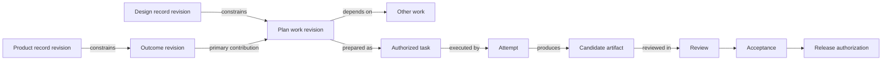

# Work is a steering system, not a set of lifecycle lanes

D-03R accepted the four owner jobs in the [v4 intake](../v4/intake.md) and rejected Plan/Active/Reviews/History as peer navigation. This revision defines one connected Work area around Overview, Development Plan, Agent Operations, and Intake. Its composition and implementation sequence remain subject to owner review.

## Responsibilities

| Surface | Owner question | Owns | Does not own |
|---|---|---|---|
| Work Overview | What needs me, what are we trying to accomplish, and is execution healthy? | Prioritized owner actions, phase/outcome rollups, agent-capacity summary, intake-review due signal | Full plan editing, attempt logs, signal triage, acceptance state |
| Development Plan | What outcomes are we pursuing, what work contributes, and what constrains the route? | Outcome → feature-cluster → work outline; phases; progress/health projections; typed dependencies; contextual decisions, reviews, and questions | Work authorization, worker scheduling, raw signal inbox, proof that an outcome was achieved |
| Agent Operations | What can run next, what is running, and where does execution need intervention? | Dependency/priority-derived queue, configured capacity, active attempts, activity, waiting/error/review handoffs, run history | Product priority authority, work history, candidate acceptance, release |
| Intake | What new evidence or ideas need deliberate disposition? | Immutable raw signal, grouping/deduplication, links, clarification, defer/archive, proposed plan changes | Automatic prioritization, task creation, authorization, execution |

Reviews, questions, decisions, and history remain typed records attached to the relevant work item. They surface wherever an owner can act, rather than becoming separate feature areas. The full work-item page is the stable return point for planning revisions, source links, task events, attempts, artifacts, review, and acceptance.

## Shared model and authority

The plan is a hierarchy plus a graph, not a strict tree. A phase contains intended outcomes. Feature clusters give work a primary planning home. Work items may contribute to more than one outcome through typed contribution links and may depend on items in other clusters. Outline, dependency map, overview rollups, queue, and detail all project the same stable item identities.

The links do not collapse authority. A plan item can exist without an executable task. Priority and queue eligibility do not authorize execution. Attempt completion does not accept a candidate. Acceptance does not release it.

Every plan revision records exact foundational consumers, such as `(record_type=product_outcome, record_id=O-LOOP, revision=3)` and `(record_type=design_direction, record_id=D-WORK, revision=2)`. When a newer source revision appears, only plan revisions consuming the changed identity become `reassessment-required`. Their previous meaning and history remain visible. A reassessment may confirm the link, revise the plan, or mark it unaffected with a reason; it never silently rewrites the plan or starts work.

## Plan projections

The outcome outline is the default. It keeps purpose, feature grouping, item state, progress, and drill-in readable without requiring dates. Collapsing a branch preserves its aggregate and health. A dependency/rollout projection places feature clusters on one axis and broad phases on the other, with selected dependencies called out as a critical chain. Selection survives switching views.

A board is deferred. Current evidence shows the owner needs purpose, phase, outcomes, dependencies, and progress more than a flow-state board. Add a board only after real use shows repeated batch movement or WIP decisions that the outline and operations queue cannot answer. The [pattern comparison](research.md) records the source evidence and reversal conditions.

Progress is derived from bounded work estimates or completed item counts and is labelled as such. Outcome health is an explicit assessment with evidence. Neither becomes evidence that the product outcome occurred; evaluation evidence remains a separate link.

## Connected journeys

1. The owner opens Overview and selects a decision. Development Plan opens the exact work identity and preserves it through outline/map switching, reload, and full-detail navigation.
2. The owner opens Agent Operations, sees why an item is ordered in the queue, and returns to the same plan item. Waiting input, failure, and review handoffs link to the work item while attempt history remains operational history.
3. The owner opens Intake when review is due, groups related signals, and receives a proposed plan change with backlinks to every original. No task or authorization is created.
4. A foundational Product or Design revision changes. The affected plan node displays its exact stale input and blocks authorization/acceptance until reassessed; unrelated nodes stay current.

## Prototype and review scope

The executable prototype is served at `http://127.0.0.1:4310/reviews/project-workspace-v5/index.html#/work`. It uses one in-memory fixture model and `sessionStorage` for the intake draft. It does not call portal APIs or demonstrate a runner, scheduler, migration, acceptance, or release.

Owner review should answer one structural question: accept this four-surface composition and staged implementation boundary, or identify which surface/responsibility needs revision. Visual polish and final field labels can follow without reopening the information model unless they expose a responsibility conflict.
