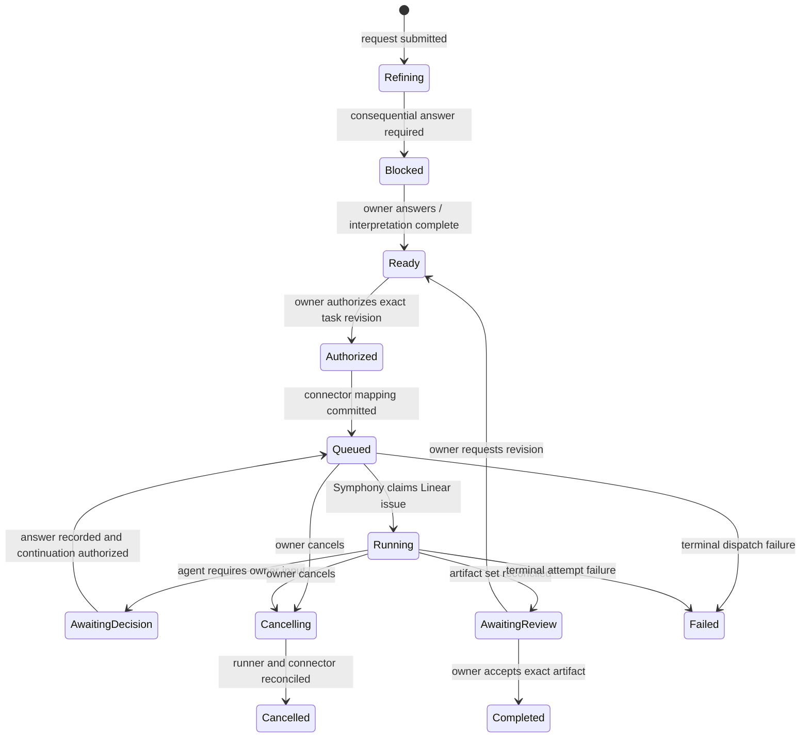

# Self-change interaction brief

## Current mockup fixture — 2026-09-18

The owner requested a separate invented application for all mockups. Use the [BorrowBox fixture](demo-app/borrowbox.md) and [D-01C v2](self-change/v2/review.html) for current design work. This original self-change scenario remains historical domain context; do not use its portal-within-portal content in new previews. The underlying task, authorization, attempt, artifact, and stale-input contracts still apply.

## Outcome under test

The owner asks the portal to **show which unanswered questions are holding up the current milestone**. The request becomes a durable task, is refined against project records, waits only on consequential input, enters the Linear/Symphony execution queue after explicit authorization, and returns an identified preview for review.

This interaction tests the full product shape. The portal is a task and review system. Codex activity appears as evidence on an attempt; it is not the primary interface.

The interaction sits inside the [product experience foundation](experience-foundation.md). D-01B must establish the global and project navigation context, use the shared intent/decision/authorization/review patterns, and present prototype instructions in a separate review harness. This brief defines domain behavior; it does not independently define the product's overall navigation or layout.

## Starting project state

The prototype opens the **Machine that Builds Itself** project at milestone **M1 — Request, run, and review**.

| Record | Starting value |
|---|---|
| Project | `portal` — Aludel |
| Milestone | `M1`, in definition/feasibility |
| Existing work | Runner direction accepted; preview and recovery proof remain open |
| Open decisions | Q-002 Go authorization scope, Q-004 interaction feel, Q-005 review-ready threshold |
| Blocking relation | Q-002 blocks implementation of task execution; Q-004/Q-005 require prototype review before final interaction acceptance |
| Worker | Local runner gateway available in the happy path; alternate scenarios change this |
| Execution connector | Linear connected and healthy in the happy path |
| Concurrency | Capacity `1`; represented as policy rather than baked into task state |

The owner enters this request in ordinary language:

> Show me which unanswered questions are holding up the current milestone, why each matters, and what work can still proceed.

## Resulting records

The portal creates these records before any execution is authorized:

| Record | Example identity | Purpose |
|---|---|---|
| Task | `PORTAL-001` | Durable unit of requested work |
| Task revision | `PORTAL-001/r1` | Frozen interpretation and acceptance inputs |
| Proposal | `proposal-portal-001/r1` | UI and behavior proposed for this task |
| Decision | `Q-002/r1` | Consequential owner choice needed before authorization |
| Authorization | Created later for task revision `r1` | Records the exact scope the owner allowed |
| Connector mapping | Portal task ↔ Linear issue | Idempotent execution-queue identity |
| Job | Created after authorization | Durable coordination record independent of runner |
| Attempt | `attempt-1` | One execution try with lease, events, inputs, and terminal result |
| Artifact set | Created by a successful attempt | Preview, source/build identity, diff, checks, limitations |
| Review | Created when artifact set is ready | Owner feedback or acceptance bound to exact identities |

Task revisions are immutable. Editing the interpretation creates `r2`; it never rewrites the inputs attached to an existing attempt.

## Product interpretation

The task detail shows an agent-proposed interpretation that the owner can edit:

**Problem:** Open questions exist in the decision register, but the owner cannot see which milestone work each question blocks or distinguish blocked work from work that can proceed.

**Proposed change:** Add a **Milestone blockers** section to the project overview. It groups unanswered decisions by consequence, shows the directly affected tasks, explains why each answer matters, and separately lists ready work that remains unblocked.

**Not included:** Answering questions automatically, changing milestone gates, starting blocked work, or releasing a build.

### Acceptance examples

1. The M1 overview shows every open decision that directly blocks an unfinished M1 gate or task.
2. Each blocker shows its question, urgency, proposed default, blocked records, and the consequence of waiting.
3. Open questions that do not block M1 appear outside the blocking count.
4. Ready work remains visible and actionable even when another task is blocked.
5. Answering or deferring a decision updates affected work without changing unrelated tasks.
6. A preview produced with an older decision revision is visibly stale and cannot be accepted as current.

## Consequential decision before execution

The interaction uses Q-002 as its concrete decision:

> When you authorize an implementation task, what may the runner do before returning it for review?

| Choice | Meaning |
|---|---|
| **Build preview** — recommended | Create/reuse a task branch or workspace, change code, run relevant checks, and create a local or hosted preview. Do not merge or release. |
| Prepare change only | Change code and run checks, but do not publish a preview externally. |
| Plan only | Produce an implementation plan and questions without modifying code. |

The recommended default is selected visually but is not accepted by elapsed time or by opening the task. The owner chooses it explicitly. The answer creates a new decision revision and unblocks only work whose required authorization is now defined.

## Primary interaction

### 1. Request and refine

The request composer remains available from the project overview, but submission opens a task detail rather than a chat-only transcript. The task header shows project, stable task ID, state, priority, milestone, dependencies, current revision, and connection health.

The detail has five persistent areas:

1. **Intent** — request, interpretation, acceptance examples, exclusions, and task revision.
2. **Decisions** — required and optional questions with consequences and proposed defaults.
3. **Execution** — authorization scope, connector mapping, worker availability, attempts, live events, cancel/retry controls.
4. **Result** — preview, source/build identity, diff, checks, limitations, and artifact history.
5. **Review** — feedback, requested revision, acceptance, and staleness.

The project overview also shows a task list or board. The detail is a stable route, so refreshing or returning later does not lose the interaction.

### 2. Resolve the blocker

While Q-002 is unanswered, the task state is **Blocked** and its primary action reads **Answer required decision**. The page explains that intent refinement and unrelated work may continue, while implementation authorization cannot.

When the owner chooses **Build preview**, the UI records the decision revision, recalculates dependencies, and moves the task to **Ready**. The activity stream says what changed and why the task became ready.

### 3. Authorize the task

The Ready state presents **Authorize task** with a compact scope summary:

- Task revision `PORTAL-001/r1`
- Source revision to branch from
- Allowed actions: edit workspace, run checks, create preview
- Disallowed actions: merge, production release, unrelated external writes
- Execution connector: Linear
- Runner: local Symphony gateway
- Current capacity and worker availability
- Stop conditions: consequential product question, unsafe/ambiguous side effect, exhausted attempt budget

Authorization persists as its own record. A later edit to the task or scope invalidates it and requires a new authorization. The UI may label this action **Go**, but the reviewable scope is visible before it is pressed.

### 4. Queue and run

Authorization first creates a portal job and an idempotent connector operation. The connector creates or updates one mapped Linear issue, records the external ID/version, applies the configured execution-eligible state/label, and marks the job **Queued**. Repeating the operation must resolve to the same mapping.

The UI shows provider-neutral state first and native details second:

| Portal state | Linear/Symphony evidence shown |
|---|---|
| Authorized | Connector write pending |
| Queued | Linear issue linked and eligible; waiting for worker/capacity |
| Running | Symphony claim, workspace, attempt number, last event, elapsed time |
| Awaiting decision | Question and consequence; Symphony input-required metadata |
| Cancelling | Cancellation requested; runner/tracker confirmation pending |
| Failed | Failed boundary, safe retry status, retained partial evidence |
| Awaiting review | Artifact set complete and reconciled |

Do not expose raw protocol events as the only progress explanation. Show a concise current stage and retain a chronological event drawer for diagnosis.

### 5. Review the result

The review surface opens the preview beside evidence for one immutable artifact set:

- Task and task revision
- Decision revisions used
- Source base SHA and result SHA
- Build/artifact digest
- Preview location and availability
- Summary of behavior changed
- Acceptance examples with pass, fail, or not tested status
- Diff summary with a route to inspect the full diff
- Check names, results, and timestamps
- Known limitations and assumptions
- Attempt ID, runner, workflow version, model/provider metadata, and reported usage

The owner chooses **Request revision** or **Accept this build**. Acceptance stores the exact artifact and input revisions. It does not merge or release the result in M1.

## Linear connector profile

The product uses semantic connector operations rather than hardcoding provider column names throughout the domain:

| Portal operation | Linear profile behavior |
|---|---|
| `ensure_mapping` | Create or find one issue containing the stable portal task reference; store Linear issue ID and version |
| `mark_ready` | Place issue in configured ready state without execution label |
| `authorize_execution` | Apply configured active/eligible state and `machine:run` label using an idempotency key |
| `record_running` | Reconcile Symphony claim and Linear active state into the current attempt |
| `block_for_input` | Remove execution eligibility or use configured blocked state; retain task mapping and workspace |
| `request_review` | Move to configured review state and remove execution eligibility after artifact reconciliation |
| `cancel_execution` | Remove eligibility/change state, request runner stop, and wait for both boundaries to reconcile |
| `complete_task` | Apply configured terminal state only after portal review policy permits it |

The Linear issue links back to the portal task and carries an execution-safe summary, acceptance examples, task revision, and context-bundle reference. Sensitive project records, credentials, and unbounded internal context are not copied.

Connector state is distinct from task state. If Linear is unavailable, the task can remain Ready or Authorized while the connector operation shows retryable, failed, or ambiguous. The portal never claims Queued until the external mapping is confirmed.

## Required alternate scenarios

### Revision path

Given artifact `A1` is awaiting review, when the owner writes “The cards need to distinguish release blockers from task-only blockers” and selects **Request revision**, then:

1. The feedback becomes a review record attached to `A1`.
2. The portal creates task revision `r2` with the new acceptance example.
3. `A1` remains inspectable and rejected/superseded; its evidence is never overwritten.
4. The task returns to Ready after dependency checks.
5. A new authorization and attempt produce artifact `A2`.

### Worker unavailable

Given the task is authorized and the Linear mapping succeeds while the local gateway has no valid heartbeat, the task shows **Queued — worker unavailable**. It displays last-seen time and keeps the task eligible without creating duplicate attempts. When the same gateway returns, it claims the existing job and starts one attempt. The owner may cancel while waiting.

### Connector unavailable or conflicting

If Linear rejects or times out during `authorize_execution`, the portal keeps the operation ID and reports **Authorization recorded — queue confirmation pending**. On retry, it first looks up the stable task mapping and provider version. If the write outcome is ambiguous or the Linear issue changed incompatibly, the task becomes **Needs reconciliation**; no second issue or attempt is created automatically.

### Agent asks a question

If Codex requires consequential input while running, the gateway persists the question before relinquishing the attempt. The task becomes **Awaiting decision**, the Linear issue is made ineligible according to the connector profile, and the workspace/thread references remain attached. Answering creates a decision revision. A separate **Continue** authorization queues a new attempt or resumes the provider thread when safely supported.

### Cancellation

Cancel records intent immediately and prevents new claims. A queued task reconciles its Linear eligibility; a running task also asks Symphony/gateway to stop. The UI shows **Cancelling** until the child process exits and connector state is confirmed. If either result is unknown, show **Cancellation uncertain** and require reconciliation rather than reporting success.

### Attempt failure

A failed attempt shows the failing stage, last safe event, partial artifacts, external IDs, and whether retry is safe. Retry always creates a linked attempt and reuses the task/Linear mapping. Automatic retries remain disabled until R-05 proves the relevant boundary.

### Stale decision or build

Given artifact `A1` used `Q-002/r1`, when Q-002 changes or task interpretation becomes `r2`, the portal marks `A1` **Stale** with the exact changed inputs. **Accept this build** is disabled for current completion. The owner can still inspect historical evidence, explicitly restore the earlier input revision, or authorize a new build.

## Acceptance scenarios for D-01B

The interactive prototype must make each scenario operable rather than describing it in static copy.

### Happy path

**Given** PORTAL-001 is blocked by Q-002, **when** the owner accepts the recommended decision, reviews task revision r1, authorizes it, watches it move through queued/running, and opens artifact A1, **then** the preview and its exact inputs/evidence are reviewable and acceptance completes only that artifact.

### Revision

**Given** A1 is awaiting review, **when** the owner requests the blocker-category revision, **then** A1 remains historical, r2 becomes the current task revision, and a later A2 can be compared with A1.

### Unavailable worker

**Given** an authorized, mapped task and an offline gateway, **when** the owner views execution, **then** the page shows queued/worker unavailable with last heartbeat, no attempt duplication, and working cancellation.

### Connector conflict

**Given** the mapped Linear issue changed since the stored provider version, **when** dispatch reconciliation runs, **then** the portal shows the conflicting fields and blocks execution until a named resolution is chosen.

### Failure

**Given** an attempt fails after workspace preparation but before artifact publication, **when** the owner opens it, **then** the failed boundary, retained evidence, external state, and safe-retry assessment are visible; retry would create attempt 2.

### Blocked input

**Given** a running agent asks a consequential question, **when** the gateway records it, **then** the task leaves running, the owner can answer in context, and continuation requires a visible authorization rather than silently restarting.

### Stale artifact

**Given** A1 is reviewable, **when** a required decision changes, **then** A1 is marked stale, the changed input is named, and current acceptance is unavailable until a matching artifact is built.

## Prototype boundary

D-01B may simulate Linear, Symphony, worker heartbeats, attempts, and artifacts, but every simulated element must be labeled. It must use realistic identifiers and state transitions from this brief. It is an interaction test, not M1 evidence.

Live behavior still required after prototype review:

- Linear authentication, mapping, version/conflict behavior, and named transitions
- Symphony discovery, App Server events, blocked input, cancellation, and workspace behavior
- Gateway heartbeat and event persistence
- Real branch/source identity, diff, checks, artifact digest, and preview
- Crash recovery and side-effect reconciliation

## Questions for prototype review

1. Does the project overview make it obvious what is blocked, what can run, and what needs attention?
2. Is the distinction between task state, connector state, and attempt state useful without feeling operationally noisy?
3. Does authorization show enough scope to be trustworthy while remaining a fast action?
4. Is the review evidence sufficient to decide between revision and acceptance?
5. Are failure, stale, and reconciliation states understandable without opening raw logs?

Owner feedback on these questions resolves Q-004 and refines Q-005 before B-01/B-03 implementation.
