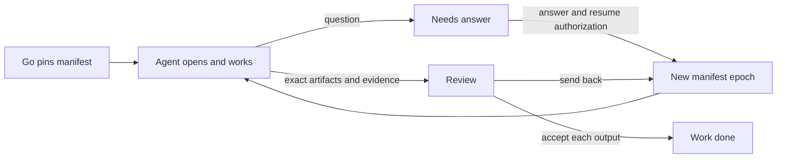

# Agent session contract v1 proposal

## Purpose and evidence boundary

The owner selected this contract pass on 2026-09-25 and deferred the LAY-05 browser review. This specifies what a solo agent or a person-paired Codex session should receive and how it should work; it does not enable any new action. The current Symphony worker pins a coding bundle and exposes `aludel_task_context` plus candidate submission. PP-01R separately exposes read-only `task_context`, `saved_context`, `read_record`, `search_knowledge` and environment status. Both are useful proofs, but their payloads and permissions differ and neither supports general questions or typed non-code submission. See [WORK-AGENTS-01](work-record.md), [current worker](../../../apps/portal/server/symphony-worker.mjs), [editor bridge](../../../apps/portal/server/editor-bridge.mjs), and [coding workflow](../../../integrations/symphony/WORKFLOW.example.md).

Borrow SPEM's role/task/work-product distinction, IDEF0's input/control/output/mechanism check, and PROV's exact-entity/activity links as design vocabulary ([analysis and primary sources](layer-output-model.md)). The transport can be Symphony host tools for solo runs and MCP for interactive Codex; both call the same Aludel domain operations. [Official OpenAI Codex documentation](https://learn.chatgpt.com/docs/extend/mcp?surface=cli) supports MCP tools in local Codex clients. [App Server documentation](https://learn.chatgpt.com/docs/app-server) describes thread start/resume and configured MCP servers. The proposed semantic contract does not depend on its experimental dynamic-tool field.

## Implementation checkpoint, 2026-09-25

The first executable slice is [built and tested locally](../../evidence/work-agents-01-audit-slice.md): Go-pinned compact task card, bounded project knowledge map/search/read, a blocking security-audit question, and an immutable report for Work review. It uses an explicit audit output adapter and retains the coding candidate adapter. This is narrower than the full contract below. In particular, the person-paired bridge still has a different context payload, knowledge links and generic record proposals are not implemented, and the owner has not reviewed a live agent run. Treat the sections below as the target contract where they exceed this slice.

## 1. Compile once at Go

Aludel creates an immutable **task manifest** from the selected work revision, role, action, profile or human execution policy, required artifact revisions, and authorization. The manifest is stored outside the agent workspace and identified by a content digest. A new authorization or material input change creates a new manifest; it never rewrites an old digest. The Work item needs a monotonic revision or equivalent canonical content fingerprint; `updatedAt` alone is not an adequate concurrency key. An attempt binds to one manifest digest and one authorization epoch.

The manifest has six groups:

| Group | Required content | Why |
|---|---|---|
| Identity | project, work, batch, attempt, authorization epoch, manifest version/digest | Correlate every read, tool call, artifact and review |
| Assignment | title, short brief, primary role/action revisions, assignee, profile revision if agent | State the job without a full project dump |
| Inputs and controls | target refs with exact revisions, required decisions/policies, relevant record summaries, repository base if used | Make the task reproducible and point at deeper context |
| Output ledger | each intended artifact type, operation, target or new identity, owner layer, required evidence and reviewer | Permit multi-output work without implied authority |
| Capabilities | project/read scope, named tool operations, writable candidate surface, effect limits, question triggers | Enforce at Aludel and host boundaries, not through prompt wording |
| Runtime | turn/run allowance, workspace type/base, stale-input rule, review route | Bound execution and recovery; no credentials in the manifest |

A role supplies enduring quality rules; an action supplies the method and default output contract; the work item narrows or adds concrete outputs and checks. A profile changes the performer/runtime and any supplemental guidance, never the action's authorized effects. For a person-paired Codex session, the same work/action/output manifest is compiled with person-scoped authority and an interactive runtime policy. The human remains accountable for actions their token authorizes.

The current `roles.json` strings (`tools`, `changes`, `asks`) are source guidance, not an enforceable permission schema. The compiler must resolve them to typed capability IDs and reject an action whose requested output lacks a safe adapter. It must not infer permission by parsing those strings. A task brief, fetched record or repository file is data and cannot widen scope.

## 2. What the agent sees on entry

Symphony's issue contains only a stable task/attempt identity, manifest digest, title, a one-sentence outcome and the instruction to open the manifest. The coding workspace is already at its pinned base. A non-code action receives an isolated scratch area for provisional artifacts; it does not need a repository clone by default. The launch text should fit on one screen, for example:

> Tool Share · W-52 · Security audit. Produce a finding report for the pinned release candidate; no code or environment changes are authorized. Attempt A-7 uses manifest `sha256:…`. Call `task_open` before work. Ask through `task_ask` if a decision blocks you; submit through `task_submit`. Your report remains a candidate until reviewed.

`task_open` returns the compact agent view of the pinned manifest: task brief; role/action guidance in short form; output ledger; required checks; named constraints; a few target summaries with IDs and revisions; tool availability; and links to inspect more. It does **not** return every record, all history, a whole source library, provider credentials, or a long workflow tutorial. Repository `AGENTS.md` may supply stable code-local rules to Codex, but the Aludel contract must stand alone for actions without a repository. Do not duplicate a large `AGENTS.md` inside the manifest.

The [security-audit fixture](session-manifest.security-audit.example.json) is a concrete proposed `task_open` response. It is synthetic and does not represent a live authorized run. Its pretty-printed agent view is about 3.5 KB as checked locally; size is a design aid, not a proven optimal token budget. Validate actual model-facing size and retrieval sufficiency with fixture runs before setting a hard limit.

## 3. Knowledge discovery on demand

The agent starts with required inputs, then retrieves only what the task warrants. If it does not know where a fact belongs, `knowledge_map` gives a compact map of permitted record kinds and relation types before it searches. For actions with a read capability, the default discovery scope is all non-secret knowledge in the project; the manifest's preferred kinds and seed links guide the search without becoming an exhaustive allowlist. A role/action may narrow this scope, and record sensitivity rules always apply. Until Aludel has an explicit sensitivity classification, the gateway must use a reviewed safe-kind allowlist and deny newly added kinds by default. Repository and environment reads have separate host permissions. The server returns stable IDs, revision, short summary and typed links before full content. Search results are bounded and paginated; no unbounded corpus dump. `read_record` can request the pinned revision or current revision explicitly. The result states which it returned. If the agent uses a newly discovered record in its result, it attaches that exact revision as a used input. Aludel validates the revision on submission and flags stale or newly controlling decisions for reassessment.

Required controlling decisions are included by ID, revision and concise operative text in `task_open`; the agent should not have to discover a known prohibition. Optional references can be found through search and one-hop typed links. `supports`, `contradicts`, `decided-by`, `derived-from`, `implements`, `tests`, `supersedes` and `blocks` retain different semantics. Browsing a link grants no write capability. A live read is discovery, not an amendment to the Go-pinned authorization.

## 4. Tool surface

Expose a small common set and only the action-specific effect tools named in the manifest. Hide irrelevant tools where a host permits it; every server handler still checks project, attempt, manifest digest, state, capability, target and expected revision. OpenAI's [MCP server guidance](https://developers.openai.com/plugins/build/mcp-server) similarly calls for focused tool operations, structured results and per-call authorization; that guidance supports the interface shape, while Aludel's exact policy below is our design.

| Tool | Model-visible purpose | Boundary/result |
|---|---|---|
| `task_open(digest)` | Read the pinned compact contract and current attempt state | Only this authorized work/attempt; no secrets |
| `knowledge_map(focus?)` | See permitted layers, record kinds and link types | Compact structure and counts; no record bodies |
| `knowledge_search(query, kinds?, cursor?)` | Find permitted records by text and filters | Small summaries, IDs, revisions and next cursor; no full bodies |
| `knowledge_read(id, revision?)` | Inspect one permitted record | Exact revision or explicitly live version, content plus typed links |
| `knowledge_links(id, relation?, cursor?)` | Follow one-hop provenance or dependency links | Typed edges and bounded neighbor summaries |
| `task_status()` | Check authorization, question, staleness and run allowance | Current authoritative state before consequential submission |
| `task_ask(question, whyBlocked, affectedOutputs, options?)` | Suspend on a concrete missing decision or input | Durable question ID; attempt becomes needs-answer; no implied permission to continue |
| `task_submit(artifactRefs, usedInputs, checks, summary, followUps?)` | Submit exact provisional outputs and evidence for review | Validates output ledger and pinned inputs; returns submission/review IDs; never self-accepts |
| `task_note(phase, summary)` | Record coarse progress or a failure reason | Bounded event, not a stream of private reasoning |

Output adapters add narrow tools only when needed: `record_propose(targetId, expectedRevision, typedPatch)` saves a candidate revision without applying it; `finding_stage(report)` validates a structured audit report; the existing host-side `aludel_commit_candidate` validates and snapshots a code commit; a preview tool builds an isolated candidate. No general `write_record`, unrestricted HTTP, or arbitrary external-effect tool is part of the common surface. A deploy/configure action needs its own effect contract and authorization gate.

Tool calls use idempotency keys for state changes and return typed errors: `not-authorized`, `stale-input`, `revision-conflict`, `needs-answer`, `invalid-output`, `already-submitted`, `temporarily-unavailable`. A retry after an uncertain outcome asks `task_status` and reuses the operation key; it does not create another question or submission. The trusted host, not the model, holds worker credentials. Person-paired MCP tokens retain person/project scope and cannot impersonate a worker or owner.

## 5. Session workflow

1. **Preflight (host):** refresh item and authorization, reserve a run, verify workspace/base and required tools, then start or resume the session. Refuse dispatch on changed controls or missing action adapter.
2. **Orient (agent):** open the manifest once; identify each requested output, its allowed effects, required inputs and review checks. Read the pinned targets first.
3. **Investigate:** follow typed links or search within permitted scope for missing context. Record the exact revisions used. If a controlling ambiguity changes the outcome or permitted effect, call `task_ask` and stop. State ordinary, reversible assumptions in the submission.
4. **Produce:** create provisional artifacts in the allowed candidate surface. A task may generate several outputs; each is checked against its own ledger entry. An audit may report a code defect without being allowed to edit code.
5. **Verify:** run available validators/tests, distinguish independent checks from agent claims, and call `task_status` before submission. A missing required check is reported as failed or skipped with reason, never silently omitted.
6. **Submit:** call `task_submit` with exact artifact IDs/digests and evidence. Symphony withdraws the eligible issue; Aludel retains artifacts even if Symphony removes the workspace. The agent does not mark work done, accept its own review, or deploy.
7. **Resume or end:** an answer, send-back or changed input creates a new manifest/authorization epoch linked to the previous attempt. The host decides whether to resume the preserved workspace. A stopped or exhausted task reports why and what decision is needed.

The initial turn should not require a rigid narrated plan. The sequence above is enforced at boundaries and summarized in a short startup instruction. The agent may inspect more when necessary. Progress events mark meaningful state changes, not every thought.

## 6. Five contract fixtures

| Fixture | Required inputs/control | Output and review | Allowed effect |
|---|---|---|---|
| Vision Brief edit | Existing claim revision, source findings, owner decision | Proposed claim revision with evidence/decision links; Product lead review | Propose only; no accepted revision before review |
| Data object contract | Object, linked stories, stack-neutral rule | JSON Schema proposal plus validation results; Data lead review | Propose object revision; validate schema |
| Code implementation | Story acceptance, Data/Page/Design revisions, base commit | Exact code commit, tests, isolated preview; Engineer/owner review | Edit scoped workspace; host commits candidate |
| Security audit | Exact code/release candidate, relevant access rules and policy | Finding report with severity, affected revision and evidence; Engineer lead review | Read/test/report only; code fix is a separately declared output |
| Role review | Submitted artifact, source checks, evidence and role policy | Criterion verdicts with cited evidence and recommendation; human lead final decision for elevated work | Review recommendation only unless a separately authorized human role may accept |

A single work item can declare both finding report and code candidate. They remain two output entries, with distinct tools, checks and reviewers. If either output needs a different authorization or independent timing, link two items instead. Process-improvement suggestions are another output entry; they never mutate the active action contract mid-run.

## 7. Gaps, verification and next implementation step

This pass applies the output ledger to the five fixtures and provides two syntactically checked compact examples: a read-only [security audit](session-manifest.security-audit.example.json) and a [Vision revision proposal](session-manifest.vision-edit.example.json). It is design evidence only. Current Work items lack a monotonic revision; existing editor and worker bundles diverge; search has no relation traversal or per-task read policy; there is no durable general question or typed non-code submission boundary. `platform.security` is correctly blocked today. The three direct structured actions currently write draft knowledge revisions before owner review and need migration to candidate proposals rather than being treated as proof of the new boundary.

Next, implement a pure manifest compiler and validator against these fixtures, then compare its compact agent view with the current bundle. The compiler must reject: nonexistent action/target, revision mismatch, output without an adapter, effect beyond the action, profile widening a capability, unpinned controlling decision, cross-project reference, and missing reviewer. Do this before changing Symphony dispatch. Verify the same semantic manifest can be read through the solo host tool and the person-paired MCP path; transport-specific credentials and runtime policy stay separate. Only then make the security audit runnable on disposable data.

## Retrospective at this design checkpoint

The avoidable friction was two independently built context paths and action guidance that names tools without an executable output contract. The reusable preparation is the output ledger plus one compact entry manifest and a small knowledge query surface. This pass tested internal coherence by mapping five unlike actions and validating two JSON fixtures; it did not test model comprehension, retrieval sufficiency, owner review or runtime permissions. The contract changes the work order: compiler/validator and one non-code adapter precede broad runner enablement. Open choices include record-level sensitivity policy, how much current project knowledge a read-capable action may search, and the exact revision model for work items. These do not block the pure compiler fixture, but must be resolved before live general-agent dispatch.
