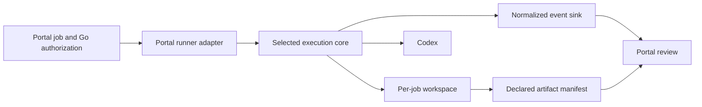

# R-06A — Pinned OpenAI Symphony implementation inspection

## Result

OpenAI Symphony supplies a substantial, tested issue-to-Codex orchestration core: tracker polling, bounded dispatch, isolated persistent workspaces, App Server event handling, retry/backoff, reconciliation, blocked-input visibility, and a status dashboard. It does not directly implement M1's portal-owned “click Go” job, durable event history, preview artifact, or review record. Its control plane is a configured external issue tracker, and its scheduler state is intentionally in memory.

Using the reference implementation unchanged would add an Elixir/OTP service (embedded in release binaries), a tracker account and credential, tracker-state synchronization, and an additional status surface before the portal can start one selected request. Those costs are larger than the narrow adapter demonstrated in R-03. Symphony remains valuable source evidence and a possible later scheduler, but reuse versus extraction is left to R-06B.

## Revision and inspection method

| Item | Inspected value |
|---|---|
| Repository | [`openai/symphony`](https://github.com/openai/symphony) |
| Revision | [`be10a1b79df723d6d7612b5651c8522704dafb2e`](https://github.com/openai/symphony/tree/be10a1b79df723d6d7612b5651c8522704dafb2e) |
| Commit date | 2026-09-15 |
| Reference implementation version | `0.0.3` in `elixir/mix.exs` |
| License | [Apache License 2.0](https://github.com/openai/symphony/blob/be10a1b79df723d6d7612b5651c8522704dafb2e/LICENSE) |
| Method | Temporary shallow clone, source/test/document inspection, and comparison with R-03 and the pinned Launch LMS case study |

This was a static implementation inspection. Elixir, Mix, and mise are not installed in the current environment, so the upstream test suite was not run. No tracker credential or external resource was created. Runtime claims are therefore either source-backed below or explicitly identified as unproven locally.

Upstream describes the implementation as evaluation-only prototype software and recommends a hardened implementation for production. Its self-contained releases support macOS and Linux on ARM64 and x86-64, but still require `codex`, `git`, and tracker credentials. See the pinned [Elixir README](https://github.com/openai/symphony/blob/be10a1b79df723d6d7612b5651c8522704dafb2e/elixir/README.md#prerequisites) and [Mix project](https://github.com/openai/symphony/blob/be10a1b79df723d6d7612b5651c8522704dafb2e/elixir/mix.exs).

## Implementation trace

### Dispatch and tracker assumptions

The orchestrator polls a configured tracker, reconciles existing work, fetches candidates in active states, sorts them by priority and age, re-fetches each issue immediately before dispatch, and starts a supervised agent task while capacity remains. Dispatch requires a valid tracker kind and a normalized, routable issue in an active state. Included adapters cover Linear, GitHub Issues, Jira Cloud, Asana, and GitLab. The core has no direct operation to submit an arbitrary portal job or dispatch a named issue; the HTTP `refresh` operation only requests another poll.

Sources: [orchestrator dispatch selection](https://github.com/openai/symphony/blob/be10a1b79df723d6d7612b5651c8522704dafb2e/elixir/lib/symphony_elixir/orchestrator.ex#L256-L307), [eligibility and dispatch](https://github.com/openai/symphony/blob/be10a1b79df723d6d7612b5651c8522704dafb2e/elixir/lib/symphony_elixir/orchestrator.ex#L781-L970), and [HTTP routes](https://github.com/openai/symphony/blob/be10a1b79df723d6d7612b5651c8522704dafb2e/elixir/lib/symphony_elixir_web/router.ex#L25-L40).

For this portal, deliberate Go could be translated into a dedicated tracker state/label, or the tracker abstraction and orchestrator would need a portal-owned adapter plus a direct dispatch command. The first option makes an external tracker authoritative; the second is a meaningful fork or extraction rather than configuration alone.

### Workspace lifecycle and isolation

Symphony derives a collision-resistant directory per issue, preserves it across attempts, and supports `after_create`, `before_run`, `after_run`, and `before_remove` hooks. It validates local paths against the configured workspace root, including canonical-path and symlink-escape checks. Repository cloning is policy supplied by `after_create`; Git behavior is not built into the core. Terminal issues trigger cleanup, while non-active issues stop without cleanup.

Sources: [workspace implementation](https://github.com/openai/symphony/blob/be10a1b79df723d6d7612b5651c8522704dafb2e/elixir/lib/symphony_elixir/workspace.ex), [workspace configuration](https://github.com/openai/symphony/blob/be10a1b79df723d6d7612b5651c8522704dafb2e/elixir/lib/symphony_elixir/config/schema.ex#L104-L123), and [reconciliation behavior](https://github.com/openai/symphony/blob/be10a1b79df723d6d7612b5651c8522704dafb2e/elixir/lib/symphony_elixir/orchestrator.ex#L410-L440).

This is a strong match for a future multi-job runner. M1 still needs a portal job ID and repository revision above the issue-derived workspace key.

### Codex session and authentication

The agent runner starts `codex app-server`, initializes it, starts a thread and turn, streams updates, and can run multiple continuation turns on the same live thread while the issue remains active. The workflow config controls command, approval policy, sandbox, turn silence timeout, stall timeout, and turn count. Current defaults reject approval/input requests and constrain turns to the issue workspace unless a workflow opts into broader behavior.

Sources: [agent runner](https://github.com/openai/symphony/blob/be10a1b79df723d6d7612b5651c8522704dafb2e/elixir/lib/symphony_elixir/agent_runner.ex), [App Server client](https://github.com/openai/symphony/blob/be10a1b79df723d6d7612b5651c8522704dafb2e/elixir/lib/symphony_elixir/codex/app_server.ex), and [configuration guidance](https://github.com/openai/symphony/blob/be10a1b79df723d6d7612b5651c8522704dafb2e/elixir/README.md#configuration).

Symphony relies on authentication already available to the configured `codex` command. Its live SSH test mounts the host's `~/.codex/auth.json`; it does not require an API key in the core. Combined with R-03's successful local Codex CLI authentication, ChatGPT sign-in is plausible for a local Symphony process, but it was not executed end-to-end in this packet.

Tracker tools execute host-side with the configured provider credential, and the implementation strips declared tracker token variables from the Codex child. This is a useful credential boundary, although raw provider tools retain whatever scope the host credential has.

### Events, questions, and observability

App Server messages are forwarded to the orchestrator. The orchestrator extracts session identifiers, token totals, rate limits, last event/message, and process metadata into an in-memory snapshot. A terminal dashboard, LiveView page, JSON state/issue endpoints, and structured logs expose current state. Approval, user-input, and MCP elicitation requests are either auto-handled by configured policy or converted into an input-required result; the issue remains claimed and appears blocked.

Sources: [Codex update integration](https://github.com/openai/symphony/blob/be10a1b79df723d6d7612b5651c8522704dafb2e/elixir/lib/symphony_elixir/orchestrator.ex#L150-L188), [request handling](https://github.com/openai/symphony/blob/be10a1b79df723d6d7612b5651c8522704dafb2e/elixir/lib/symphony_elixir/codex/app_server.ex#L600-L720), [observability controller](https://github.com/openai/symphony/blob/be10a1b79df723d6d7612b5651c8522704dafb2e/elixir/lib/symphony_elixir_web/controllers/observability_api_controller.ex), and [blocked-state documentation](https://github.com/openai/symphony/blob/be10a1b79df723d6d7612b5651c8522704dafb2e/elixir/README.md#how-it-works).

The JSON API is a snapshot interface, not an ordered durable event stream. It exposes no portal callback or artifact manifest. Blocked state disappears on restart. A portal wrapper would still need to normalize and persist the R-03 event contract.

### Cancellation, retries, and restart recovery

Symphony stops a running task when tracker reconciliation sees a terminal, non-active, or unroutable issue. Terminal transition also removes the workspace. Stall detection terminates the task and schedules exponential backoff. Normal completion while the issue remains active schedules a short continuation check; abnormal exits schedule capped exponential retries.

Sources: [termination and stall handling](https://github.com/openai/symphony/blob/be10a1b79df723d6d7612b5651c8522704dafb2e/elixir/lib/symphony_elixir/orchestrator.ex#L554-L634), [retry scheduling](https://github.com/openai/symphony/blob/be10a1b79df723d6d7612b5651c8522704dafb2e/elixir/lib/symphony_elixir/orchestrator.ex#L1025-L1065), and [retry delay](https://github.com/openai/symphony/blob/be10a1b79df723d6d7612b5651c8522704dafb2e/elixir/lib/symphony_elixir/orchestrator.ex#L1232-L1243).

There is no per-run cancellation endpoint or explicit owner cancellation record. Cancellation is an eventual consequence of changing tracker eligibility and polling or requesting refresh. Scheduler claims, retry timers, blocked entries, running sessions, and provider thread IDs are not durable. After restart, Symphony polls the tracker and reuses preserved workspaces, then starts a new eligible session. The specification explicitly lists persisted retries and session metadata as future work.

Sources: [restart semantics](https://github.com/openai/symphony/blob/be10a1b79df723d6d7612b5651c8522704dafb2e/SPEC.md#143-partial-state-recovery-restart), [operator controls](https://github.com/openai/symphony/blob/be10a1b79df723d6d7612b5651c8522704dafb2e/SPEC.md#144-operator-intervention-points), and [implementation TODO](https://github.com/openai/symphony/blob/be10a1b79df723d6d7612b5651c8522704dafb2e/SPEC.md#182-recommended-extensions-not-required-for-conformance).

## M1 capability matrix

`Supported` means the pinned implementation contains the behavior. `Adaptable` means an integration or bounded change is required. `Missing` means the portal must supply the capability outside Symphony or add a new subsystem.

| Required M1 capability | Rating | Evidence and required adaptation |
|---|---|---|
| Owner deliberately starts selected work | Adaptable | Eligibility is tracker state/label plus polling. Add a portal tracker adapter/direct dispatch command, or mirror Go into an external tracker. |
| Local execution with existing ChatGPT sign-in | Adaptable | Host Codex auth is inherited and R-03 proved local ChatGPT login, but this exact Symphony/App Server path was not run locally. |
| Bounded concurrency | Supported | Global, per-state, and optional per-worker limits are enforced by the orchestrator. |
| Isolated persistent workspace | Supported | Per-issue paths, lifecycle hooks, preservation across attempts, and path guards are implemented. |
| Repository-owned workflow policy | Supported | Versionable `WORKFLOW.md` supplies typed config and prompt and reloads while running. |
| Structured progress and usage | Adaptable | App Server events and token/rate-limit data feed snapshots and logs; portal must persist ordered normalized events. |
| Owner question / blocked state | Adaptable | Input-required is detected and displayed, but state is memory-only and there is no portal answer/resume API. |
| Explicit cancellation | Adaptable | Tracker state reconciliation stops tasks; add a direct command and durable cancellation intent/result. |
| Retry and stall handling | Supported | Capped exponential retry, continuation retry, and stall restart exist during one process lifetime. |
| Restart recovery without duplicate ambiguity | Adaptable | Workspaces and tracker truth survive; attempts, timers, sessions, and side-effect checkpoints do not. R-05 remains necessary. |
| Preview/artifact manifest | Missing | Core Symphony has no preview publisher or immutable artifact contract. |
| Owner review bound to exact build/source | Missing | Core workflow may implement a handoff, but no review identity or staleness contract is built in. |
| Multi-project portal boundary | Adaptable | One workflow config and tracker scope drive a service. Multiple projects require separate instances/configuration or a new control layer. |
| Zero-incremental-cost bootstrap | Adaptable | Code is Apache-2.0 and runs locally; tracker dependency/setup and unverified subscription-auth behavior add operational cost even if monetary cost is zero. |

## Launch LMS: upstream behavior versus project policy

The pinned Launch LMS infra revision remains [`e1ef1abf09667219276bfa6bfa0e9416328ab998`](https://github.com/Life2LaunchLabs/launch-lms-infra/tree/e1ef1abf09667219276bfa6bfa0e9416328ab998). It runs older Symphony `v0.0.2` and Codex `0.154.0` in a resource-limited container. Its working system confirms that Symphony can be operated with persistent workspaces and a loopback dashboard, but several valuable behaviors are Launch-specific additions:

| Behavior | Upstream Symphony | Launch LMS addition |
|---|---|---|
| Start authority | Active tracker state, labels, routing | Jira `symphony` label plus explicit enabled/paused markers and a one-worker policy |
| Authentication | Uses host Codex auth; tracker credentials stay host-side | Forces funded API-key login on every start, replacing ChatGPT login |
| Pause/resume | Change issue eligibility or stop/restart service | Durable `PAUSED` marker renders no active states; persistent volume retains workspaces |
| Review evidence | Workflow-defined agent behavior only | Narrow evidence uploader validates paths, sizes, formats, checks, PR head, and Jira handoff |
| Owner approval | Possible tracker handoff convention | Jira move to Merge binds approval to reviewed SHA; head changes invalidate approval |
| Deployment | Outside Symphony core | Candidate, checks, exact-head merge, environment lock, deploy verification, and signoff workflows |
| Isolation | Workspace and Codex sandbox settings | Container resource/capability limits; no Docker socket, app volume, production DB, or deploy SSH key |
| Recovery | Tracker polling plus preserved workspace | Host pause/cutover/archive runbooks and independent operations path; some restore work remains unfinished |

Sources: pinned Launch [worker README](https://github.com/Life2LaunchLabs/launch-lms-infra/blob/e1ef1abf09667219276bfa6bfa0e9416328ab998/symphony/README.md), [container definition](https://github.com/Life2LaunchLabs/launch-lms-infra/blob/e1ef1abf09667219276bfa6bfa0e9416328ab998/docker-compose.symphony.yml), [entrypoint](https://github.com/Life2LaunchLabs/launch-lms-infra/blob/e1ef1abf09667219276bfa6bfa0e9416328ab998/symphony/entrypoint.sh), and [review gate](https://github.com/Life2LaunchLabs/launch-lms-infra/blob/e1ef1abf09667219276bfa6bfa0e9416328ab998/symphony/review_gate.py).

The transferable pieces are the contracts around deliberate authorization, persistent workspaces, narrow credentialed effects, immutable review identity, and stale-review invalidation. The container fleet, Jira workflow, evidence uploader daemon, funded API login, and deployment machinery should not be attributed to upstream or imported wholesale.

## Integration sketch for this portal

If Symphony is wrapped, the smallest credible integration is:

1. Implement a portal-owned tracker adapter whose records use portal job IDs and durable authorization state.
2. Add direct dispatch, cancel, and answer/resume operations rather than relying on polling latency and indirect tracker transitions.
3. Persist normalized events, attempts, Codex thread IDs, cancellation intent, and blocked state outside the in-memory orchestrator.
4. Add a declared artifact/preview manifest bound to source and build identities.
5. Keep Symphony's workspace manager, concurrency/reconciliation logic, workflow loader, and App Server event translation where they reduce code.
6. Run the service locally with one worker and existing Codex auth; defer tracker-native tools and remote workers.

That adaptation touches the integration, coordination, and observability layers. It is materially more work than placing a small portal protocol around the SDK/CLI path proven in R-03, so R-06B should compare maintenance and future scale benefits before selecting it.

## What could reverse this assessment

- A supported upstream direct-dispatch/cancel API and durable event/session store would remove the largest portal-integration gaps.
- A local trial showing Symphony works immediately with ChatGPT subscription auth and a lightweight portal-owned tracker adapter could lower setup estimates.
- M1 requirements expanding to many concurrent issue-driven jobs or several remote workers would make its scheduler and reconciliation more valuable sooner.
- Evidence that a small custom worker cannot safely handle workspace cleanup, blocked input, or retry reconciliation would favor extracting or wrapping more of Symphony.

R-06A is complete because every required M1 capability is classified and tied to pinned documentation or code. R-06B must now choose between wrapping Symphony, extracting narrow components/contracts, or implementing the minimal local runner.
