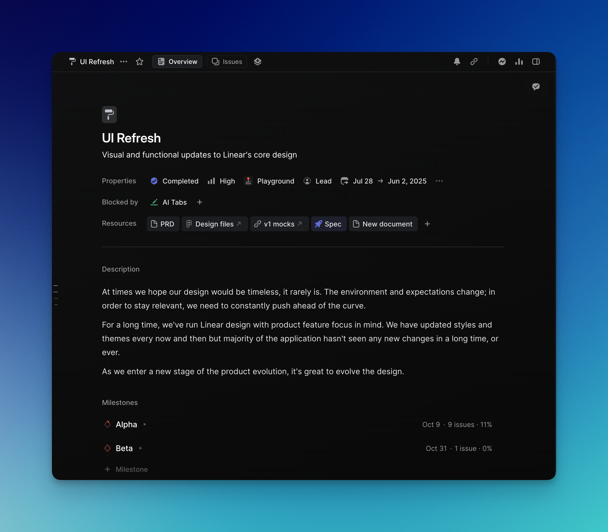
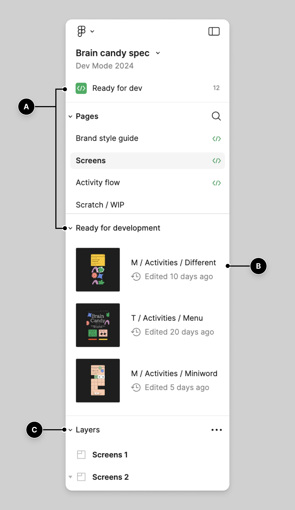
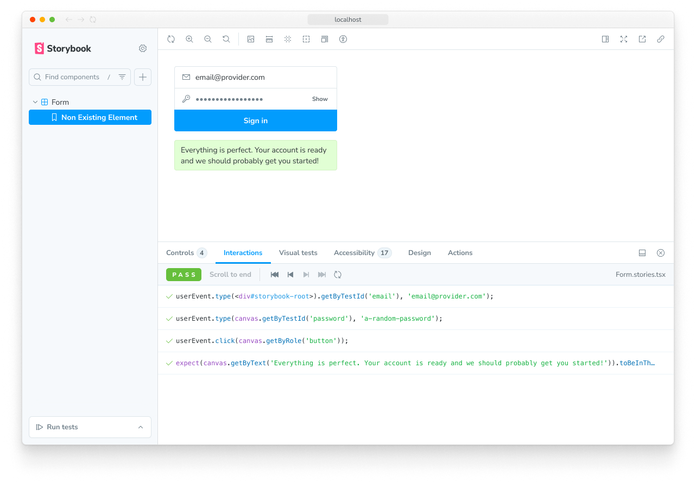
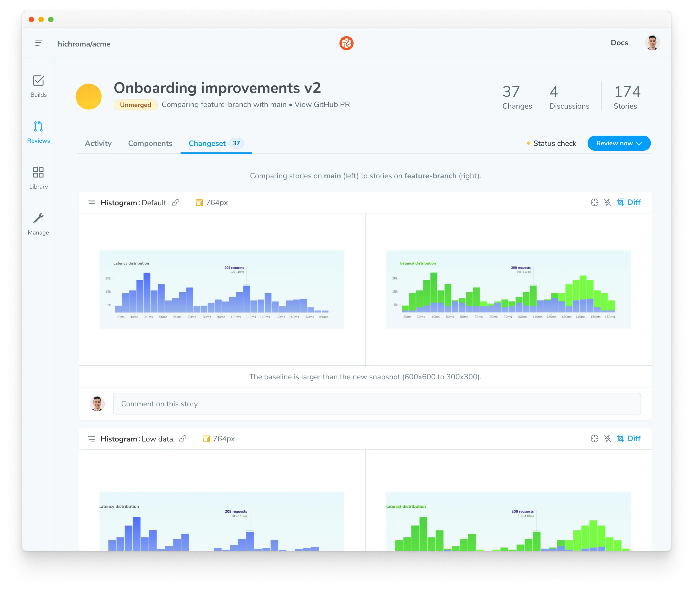

# R-07B — Product-development workflow benchmark

## Recommendation

Keep a small portal-owned chain of intent, decision revisions, authorization, artifacts, and acceptance. Reuse specialist tools for execution tracking, visual exploration, component examples, and code/visual review. Do not build a canvas editor, component workshop, or full diff viewer into the bootstrap.

The strongest replacement candidate is now **Linear with coding sessions and Reviews**, not just Linear as an issue tracker. It deserves a future bounded comparison with the Symphony wrapper. Its documented paid-plan and credit requirements do not fit the current zero-incremental-cost constraint. Lovable can collapse planning, implementation, preview, and visual revision into one workspace, but this review does not establish its suitability for the portal's decision lineage, recovery, or existing-repository workflow.

These are research recommendations, not new owner decisions or verified integrations. ADR-008 remains accepted. The next packet is D-01C: explore and review the feature's information hierarchy before another executable prototype.

## Method and scope

All linked primary sources were accessed **2026-09-18**. This is a documentation-backed scenario walkthrough with visual inspection of four downloaded publisher screenshots. No accounts were connected, credits consumed, products installed, or external records written. No scenario was executed inside an authenticated vendor application. Screenshots demonstrate the publisher's examples, not this portal feature or successful integration in this environment.

**Evidence labels:** documented means supported by a cited primary page; observed means visible in the retained reference image; proposed means our scenario mapping or recommendation. A gap means the reviewed evidence does not establish the capability, not that no extension could supply it. Current documentation can change independently of screenshots; Figma's retained example visibly labels itself 2024.

The comparison covers five materially different approaches: tracker-led Linear, canvas-led Figma, code-led Storybook, agent-led Lovable, and snapshot-led Chromatic. GOV.UK supplies an additional mature interaction-pattern reference. This is a purposive sample across workflow boundaries, not an exhaustive market ranking or timed usability study.

## Common scenario and traceability probes

Use the substantial self-change in [D-01A](../design/self-change-brief.md): show unanswered questions blocking the current milestone, explain their consequences, and preserve unrelated ready work. It crosses Overview, Decision, Work, and Review; its complexity comes from changing inputs and authorizing effects, not just displaying a list.

For every approach, follow the same proposed fixture:

1. **Brief B1:** owner cannot distinguish milestone blockers from optional questions. The desired outcome is a correct next action without reading task history.
2. **Research R1:** can the owner identify the blocking decision and one independent ready task? Test hierarchy and terminology, not visual taste alone.
3. **Design D1:** compare a milestone-oriented summary with a decision-oriented work list; inventory empty, unresolved, answered, deferred, unavailable-worker, and stale-result states.
4. **Decision Q1/r1:** only dependent work is blocked. Task T1 depends on Q1; T2 does not. Deferring Q1 leaves T1 blocked.
5. **Authorized input I1:** freeze B1, selected D1, Q1/r1, and acceptance examples before implementation.
6. **Artifact A1:** identified preview and checks; owner asks to distinguish gate blockers from task-only blockers.
7. **Revision B2/A2:** retain feedback on A1. Changing Q1 to r2 makes A1 stale for current acceptance while retaining historical review.

These symbolic IDs are research fixtures, not newly accepted project records. The feature being built and the workflow used to build it must both preserve this chain.

## Journey matrix

Cells below are **proposed mappings** to the documented primitives in the source register. “External” identifies a handoff that the approach does not itself establish.

| Stage | Linear: tracker-led | Figma: canvas-led | Storybook: code-led | Lovable: agent-led | Chromatic: snapshot-led |
|---|---|---|---|---|---|
| Brief and research | Project document holds B1/R1; milestone groups T1/T2 | Brief/references accompany design frames; research findings linked externally | B1/R1 remain upstream documents | Plan conversation refines B1; saved plan captures scope | B1/R1 linked from PR/review; research external |
| Information architecture | Project → milestone → issues organizes delivery; product navigation still needs a spec | Map Overview → Decision → Work → Review as frames/flows | Group view/component stories; this is a workshop hierarchy, not product IA | Ask plan to name view responsibilities before building | Review groups changed stories, not product areas |
| Concepts | Link two alternatives from project resources | Put both D1 alternatives on canvas for comparison | Alternative stories require code; too costly for first composition | Ask for alternatives before approving a plan; no automatic evidence they were meaningfully compared | Consume alternatives built elsewhere |
| View/component specification | Link D1/state contract from issue | Frames, component structure, annotations and development status | Explicit props/context and named states become executable examples | Approved plan supplies components/data/API intent; require state inventory explicitly | Consume source stories/screenshots; add review context |
| Prototype | External linked prototype, or paid coding session | Connect frame flows and present them for feedback | Exercise implemented views and interactions locally | Build produces app preview | Review rendered states; link runnable product for full journey |
| Implementation handoff | Issue scope + resources → selected worker | Identify selected design/version; inspect via Dev Mode | Story source travels with implementation in Git | Plan approval → build; GitHub sync supports code handoff | CI build of branch → changeset |
| Review | Reviews shows PR/diff/check context; add business acceptance externally | Review flow/composition; cannot establish live worker recovery | Play functions exercise T1/T2 behavior with controlled inputs | Try preview; point to affected element or comment | Compare base/head states; discuss specific snapshot |
| Revision | Update work/PR; explicitly retain old input references | Revise selected design; preserve the version used by A1 externally | Change fixtures/code; retain prior revision through source control | Revise plan or preview; archive/link approved inputs | New build + tracked change requests; keep A1 reference |
| Provenance and stale inputs | Portal must bind Q1 revision to artifact acceptance | Design history does not alone link Q1/r2 to A1 invalidation | Source revision identifies code, not owner authorization | Plan history/code sync help; cross-record invalidation unproven | Snapshot discussion anchors visual feedback; decision invalidation remains portal work |

## Documented capabilities and constraints

### Linear

Project overview supports descriptions, documents, external resources, and milestones [L1]. Milestones group issues and expose progress [L2]. Current coding sessions can turn delegated issue context into a PR, with verification screenshots/recordings when produced; they require Basic, Business, or Enterprise and consume AI credits [L3]. Reviews supplies PR files, checks, comments, and GitHub synchronization, with workspace code access and a personal GitHub connection [L4].

The free plan lists two teams and 250 issues; paid coding must not be inferred from the free plan's “Agent platform” label [L5], [L3]. No paid trial or code-access grant was attempted. **Proposed use:** retain Linear for the already-selected execution connector and link native reviews when available. Avoid maintaining a second complete PR-review implementation. **Unproven:** exact decision-to-build invalidation and zero-cost managed execution with the owner's existing subscription.

### Figma

Figma prototypes connect frames into flows with starting points and support presentation/comments [F1]. Dev Mode exposes development readiness, edited information, inspection, and design version history [F2]. Starter is free with limited access; the pricing page places advanced Dev Mode inspection in Professional [F3]. Account/seat eligibility must be checked before making paid handoff tools a dependency.

**Proposed use:** borrow explicit alternative selection, named flows, and design readiness. A link plus selected version/export is enough for bootstrap; Figma need not become the database for decisions. D-01C can use local diagrams instead of requiring an account. **Unproven:** layout inspection or a ready-for-dev label demonstrating behavioral correctness, owner execution authorization, or a matching implementation artifact.

### Storybook

Stories describe rendered component states [S1]. Play functions can simulate actions and assert results, with an Interactions panel for inspection and Vitest integration for automated execution [S2]. The project is open source [S3]; local use does not require a hosted Chromatic account. Toolchain setup and story maintenance still cost time.

**Proposed use:** once the design is selected, express DecisionCard and ArtifactReview states as stories, then test answering Q1 while T2 remains unchanged. Use source-controlled examples as implementation evidence, keeping the review harness outside the product. **Unproven:** a mocked story proving persistence, connector behavior, or recovery. Do not use Storybook to force early layout exploration into code.

### Lovable

Plan mode supports editable plans, approval into building, revision history within a planning round, and archived approved plan files [A1]. The preview toolbar supports element selection, inline text edits, annotations, and comments [A2]. GitHub integration supports export and two-way code sync [A3].

Free usage is bounded: the pricing page lists five daily build credits, capped at 30 per month; plan documentation describes one credit per planning message plus any additional research usage [A4], [A1]. Account creation and code synchronization were not attempted. **Proposed use:** borrow reviewable plan revisions and feedback anchored to the preview. **Unproven:** total cost for this feature, safe migration of this existing workspace, persistent decision dependencies, and recovery semantics. A paid agent builder is not required for D-01C.

### Chromatic

UI Review compares branch snapshots, can attach reviews to PRs, tracks requested changes, and attaches discussions to specific snapshots [C1]. The public free offer lists 5,000 billed snapshots, Chrome, and Git/CI integrations [C2]. The flattened pricing comparison does not clearly establish every UI Review entitlement; verify account eligibility before depending on that workflow. A hosted trial would require an account and artifact upload, neither performed here.

**Proposed use:** borrow explicit baseline/candidate identity, focused changesets, and feedback attached to the reviewed state. Consider hosted visual regression after local stories exist. **Unproven:** a visual approval establishing Q1 dependency behavior, authorization validity, or acceptance of the actual deployed build.

### GOV.UK interaction patterns

The check-answers pattern puts an explicit confirmation after a structured summary, provides targeted change links, and retains previous input when revising [G1]. **Proposed use:** borrow this for task authorization: scope, affected project, allowed effect, then a clearly named confirmation. Keep this distinct from accepting the resulting build. It is a transaction pattern, not a style prescription for the portal or proof that a long confirmation page is needed.

## Annotated visual references

The four assets below were downloaded from public primary documentation and visually inspected locally. They remain unaltered; annotations are the numbered notes below, not edits to the publisher's pixels. [Manifest](r-07b-references/manifest.json) records source page, direct asset URL, date, byte count, and SHA-256. Publisher screenshots retain their original authorship; they are research references, not reusable portal assets.

### V1 — Linear: purpose before work mechanics

Observed: a project title and one-sentence purpose precede properties; resource links and a blocked-by relation sit above description and milestones. **Borrow:** concise purpose and linked evidence close to the current outcome. **Avoid:** assuming a milestone progress percentage explains which owner decision matters. D-01C should test whether the owner can find both the blocker and independent ready work without reading the full description. Source: [L1].

### V2 — Figma: accepted work is distinguishable from exploration

Observed: publisher callout A identifies readiness navigation, B points to a design entry with edited age, and C identifies layers; scratch/WIP is a separate page. **Borrow:** distinguish the selected design input from unfinished exploration. **Avoid:** treating “edited 10 days ago” as sufficient provenance. Our task needs a pinned design revision and the reason it was selected. This is an older illustrative interface in current documentation, not a verified current account UI. Source: [F2].

### V3 — Storybook: test apparatus stays outside the component

Observed: navigation identifies a story, the component occupies the canvas, and a separate Interactions panel shows actions/assertions with pass indicators. **Borrow:** inspect one named state and its checks without putting test controls into the product. **Avoid:** interpreting the publisher's PASS as evidence for our feature. D-01B's harness should adopt the separation; later stories can cover Q1 answer/defer/stale states. Source: [S2].

### V4 — Chromatic: make the comparison explicit

Observed: review title, branch comparison, change/discussion counts, a changeset tab, paired images, and a story-specific comment field. **Borrow:** say what is being compared and attach feedback to that artifact/state. **Avoid:** reducing acceptance to pixel differences. Our review additionally needs acceptance examples and the decision revisions used. Source: [C1].

Lovable's preview-toolbar instructions were inspected as documentation, not operated. GOV.UK's public HTML example was inspected as source, not claimed as an interaction recording. Those limitations do not alter the four retained visual references above.

## What to build, adopt, integrate, and avoid

| Choice | Recommendation and removed work | Remaining portal responsibility |
|---|---|---|
| Build narrowly | Typed links from brief/design/decision revisions to authorized task and artifact review | Detect affected stale inputs; preserve history; explain the next owner action |
| Adopt now as process | Explicit design readiness, proportional state inventory, selected alternative with rationale, review script | Owner selection still precedes D-01B |
| Adopt at implementation | Repository-owned component stories, if the small state trial pays for setup | Integration/recovery tests remain separate |
| Integrate first | Linear connector per ADR-008; link its issue and native code-review surfaces | Authorization, attempt reconciliation, product-level acceptance |
| Integrate optionally | Versioned external design references and later hosted visual checks | No duplicate live authority for design or decision records |
| Reconsider replacement | Linear managed coding/reviews or Lovable for a bounded project | Require an observed cost, portability, provenance, and recovery comparison |
| Avoid | Custom design canvas, generic workflow engine, full PR viewer, mandatory large artifact tree for small edits | Keep the M1 loop small and demonstrable |

Existing tools eliminate meaningful specialist work, but the reviewed evidence does not establish a complete substitute under the current budget and ownership requirements. This is a conditional conclusion: absence from these sources is not proof of absence from the products.

The hybrid knowledge direction remains plausible, not proven. Store external identity plus selected revision/export and local digest in task inputs. Do not synchronize all provider text into two editable authorities. A current URL alone cannot reproduce what an agent or owner reviewed.

## Local experiments and reversal criteria

These are follow-on recommendations, **not tests claimed to have passed** and not additional packets executed here.

| Experiment | Where / bounded method | Passing evidence | What would reverse the recommendation |
|---|---|---|---|
| Hierarchy and direction | D-01C: compare two loose compositions using B1/Q1/T1/T2 | Owner identifies blocked work and independent ready work, explains the primary action, and selects/revises a direction | Both concepts require oral explanation: revise content/IA before code |
| Input provenance | Before M1 data boundary is finalized: export a small B1/D1/Q1 bundle; change Q1 and retrieve A1's inputs | A1 still resolves old inputs; affected current work is stale; T2 is unchanged; missing references fail visibly | Plain revisioned files plus an index satisfy the queries with less complexity: reduce database scope |
| Workshop usefulness | After selected direction: implement one component's unresolved, deferred, answered, and stale states | States independently inspectable; one behavior test catches an intentionally wrong transition | Setup/duplication exceeds usefulness: retain lighter fixtures until more components exist |
| Review comprehension | D-01B: show A1 then revised A2 and ask what acceptance covers | Owner identifies exact result, relevant checks, changed input, and revise/accept consequence | Side-by-side comparison distracts: use focused candidate with optional history |
| Product replacement | Only after account/spend authorization if needed: same fixture in Linear managed coding or Lovable | Exportable inputs/code/reviews; bounded measured cost; stale/retry behavior demonstrated | Full chain works at acceptable cost with less custom coordination: reopen ADR-008 and portal scope |

No experiment here requires a new portal screen during R-07B. D-01C is ready because D-01A and R-07B are complete; its eventual direction selection remains an owner review gate.

## Primary source register

All access dates: **2026-09-18**. Direct links are preserved so later reviewers can recheck changing capabilities and limits.

- [L1] — project purpose, resources, documents; V1.
- [L2] — issue grouping and milestone progress.
- [L3] — managed implementation, verification artifacts, paid-plan and credit boundary.
- [L4] — review and GitHub access requirements.
- [L5] — free limits and paid offerings.
- [F1] — prototype flows and feedback.
- [F2] — readiness, inspection, history; V2.
- [F3] — limited Starter and advanced paid handoff.
- [S1] — state examples.
- [S2] — play functions and interaction inspection; V3.
- [S3] — source and license.
- [A1] — approval, revision, archive, usage.
- [A2] — preview feedback modes; former visual-edit URL redirects here.
- [A3] — code export and synchronization.
- [A4] — free credits and usage limits.
- [C1] — visual review and snapshot discussions; V4.
- [C2] — free snapshot allowance; feature entitlement caveat above.
- [G1] — summary, targeted revision, and explicit confirmation.

[L1]: https://linear.app/docs/project-overview "project purpose, resources, documents; V1."
[L2]: https://linear.app/docs/project-milestones "issue grouping and milestone progress."
[L3]: https://linear.app/docs/coding-sessions "managed implementation, verification artifacts, paid-plan and credit boundary."
[L4]: https://linear.app/docs/diffs "review and GitHub access requirements."
[L5]: https://linear.app/pricing "free limits and paid offerings."
[F1]: https://help.figma.com/hc/en-us/articles/360040314193-Guide-to-prototyping-in-Figma "prototype flows and feedback."
[F2]: https://help.figma.com/hc/en-us/articles/15023124644247-Guide-to-Dev-Mode "readiness, inspection, history; V2."
[F3]: https://www.figma.com/pricing/ "limited Starter and advanced paid handoff."
[S1]: https://storybook.js.org/docs/get-started/whats-a-story "state examples."
[S2]: https://storybook.js.org/docs/writing-tests/interaction-testing "play functions and interaction inspection; V3."
[S3]: https://github.com/storybookjs/storybook "source and license."
[A1]: https://docs.lovable.dev/features/plan-mode "approval, revision, archive, usage."
[A2]: https://docs.lovable.dev/features/preview-toolbar "preview feedback modes; former visual-edit URL redirects here."
[A3]: https://docs.lovable.dev/integrations/github "code export and synchronization."
[A4]: https://lovable.dev/pricing "free credits and usage limits."
[C1]: https://www.chromatic.com/docs/review/ "visual review and snapshot discussions; V4."
[C2]: https://www.chromatic.com/pricing "free snapshot allowance; feature entitlement caveat above."
[G1]: https://design-system.service.gov.uk/patterns/check-answers/ "summary, targeted revision, and explicit confirmation."

## Completion evidence

Five approaches traced through the same nine stages; four inspected publisher screenshots with provenance and annotations; current primary documentation and cost/account constraints; specialist-tool replacement analysis; bounded local experiments with reversal criteria. No live integration, usability result, recovery proof, or phase transition is claimed. Documentation links and local asset hashes are checked separately in the validation note.

### Validation note — 2026-09-18

Local validation passed: 36 relative file/asset links across the four changed Markdown documents resolve; all 18 source-reference labels resolve; all four captured asset byte counts and SHA-256 hashes match the manifest; status has exactly one next_action (D-01C). Primary pages were opened during research. Anchor rendering and authenticated vendor interactions were not browser-tested; no browser executable or local Playwright package was available. No application tests apply to this documentation-only packet.
