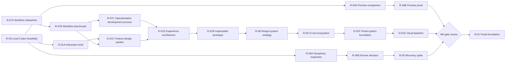

# Execution plan

This document translates the roadmap into executable work packets. [Current status](status.md) names the next packet. Each packet has a question, bounded actions, an output, and completion evidence. Packet IDs remain stable even if their content is refined.

## Operating sequence

The diagram expresses dependencies, not permission to run everything automatically. The owner starts work deliberately, and `docs/status.md` exposes the selected packet.

## Packet closure and retrospective

Every packet ends with a post-hoc before it is marked complete. Use observed work to identify avoidable friction, a reusable improvement, effects on later packets or phase gates, and newly important questions. Apply justified changes to this plan, operating guidance and the decision register during closeout; do not leave useful learning stranded in the packet evidence. Separate changes proven useful in the completed work from changes that need a future trial. Routine packets may use a short evidence section; consequential or corrective packets should link a separate retrospective from `docs/status.md`.

## M0 — Definition and feasibility

### R-03 — Local Codex adapter feasibility

**Question:** Can an owner-triggered local process use the existing supported ChatGPT sign-in to execute a bounded repository task and expose enough structured lifecycle information for the portal?

**Actions:**

1. Inspect installed Codex version and supported SDK/App Server/non-interactive capabilities without exposing authentication material.
2. Define the smallest event contract the portal needs: accepted, started, progress, question/blocked, completed, failed, cancelled, plus artifact references and usage when available.
3. Run a harmless disposable task against a temporary fixture or read-only repository task. Do not use production credentials or modify external systems.
4. Test cancellation or document precisely why the selected interface cannot support it.
5. Test continuation/resume across a process boundary if supported.
6. Record command/interface, environment assumptions, observed events, latency, reported usage, failure behavior, and gaps.

**Output:** `docs/evidence/r-03-local-codex.md` plus any minimal disposable fixture needed to reproduce the test.

**Complete when:** evidence demonstrates start and terminal status with captured structured output; cancellation and resume are either demonstrated or recorded as unsupported; the report recommends SDK, App Server, `codex exec`, or a staged combination for M1. No secret appears in evidence or Git changes.

### R-06A — Pinned Symphony implementation inspection

**Question:** Does the current OpenAI Symphony implementation provide the local scheduling/workspace/run behavior M1 needs at lower cost than a small adapter?

**Prerequisite:** R-03 complete, so comparison criteria reflect observed Codex behavior.

**Actions:** pin the reviewed repository revision; confirm license and runtime requirements; trace manual dispatch, tracker assumptions, workspace lifecycle, event visibility, cancellation, recovery, and authentication; identify extension points and required modifications. Do not adopt it from the specification alone.

Use the owner's working [Launch LMS case study](references/launch-lms-case-study.md) to distinguish upstream Symphony behavior from project-specific harness policy and infrastructure. Revisit the cited exact revisions when necessary; do not assume the whole Launch LMS system is the desired design.

**Output:** `docs/evidence/r-06a-symphony-inspection.md` with revision, links, capability matrix, and integration sketch.

**Complete when:** every required M1 runner capability is marked supported, adaptable, or missing with cited code/document evidence.

### R-06B — Runner reuse decision

**Question:** Should M1 wrap Symphony, extract a narrow component, or implement a minimal owner-triggered runner?

**Prerequisites:** R-03 and R-06A.

**Actions:** compare setup burden, dependencies, tracker coupling, observability, local sign-in compatibility, manual start, isolation, recovery, and future server migration. Prefer the smallest option that passes M1 requirements and retains a replaceable job protocol.

The comparison must include the fourth option of extracting only the proven contracts from Launch LMS—such as immutable candidates or exact-head review—without adopting its full orchestration and operations stack.

**Output:** add an accepted or rejected ADR in `docs/decisions.md`; update `docs/architecture.md` and the B-03 packet if needed.

**Complete when:** one option is selected with evidence, rejected alternatives, consequences, and a recheck trigger.

### D-01A — Self-change interaction brief

**Question:** What exactly should the owner experience when requesting “show which unanswered questions are holding up a release”?

**Actions:** define the starting project state, request text, durable task and revision, system interpretation, one consequential decision, proposed default, dependencies, authorization transition, Linear mapping/state, blocked and unblocked work, run/attempt visibility, review evidence, revision path, and acceptance scenarios. Identify which details can be tested with a prototype and which need live tracker or agent behavior.

**Output:** `docs/design/self-change-brief.md`.

**Complete when:** the happy path, revision path, unavailable-worker state, failure state, and stale-decision/build state each have concrete acceptance examples.

### R-07A — Product-development workflow rebaseline

**Question:** What design and knowledge work must exist between product intent and a code prototype, and how should a fresh agent workspace receive the relevant context?

**Actions:** treat D-01B owner feedback as evidence; research fit-for-purpose prototyping, research planning, inspectable component states, and Codex repository instructions using current primary sources; define a proportional artifact hierarchy; separate mutable portal records, code-adjacent repository knowledge, large artifacts, and generated task context.

**Output:** `docs/evidence/r-07a-product-workflow-rebaseline.md`, `docs/design/product-development-workflow.md`, and `docs/knowledge-strategy.md`.

**Complete when:** the project has an explicit intent-to-screen workflow, risk-scaled artifact policy, design review gates, database/repository boundary, and deterministic fresh-workspace bootstrap. Record what remains inference and what research could change it.

### R-07B — Existing workflow and design-system benchmark

**Question:** Which parts of the proposed product-development workflow should be adopted, integrated, or avoided based on working tools and mature design systems?

**Prerequisite:** R-07A.

**Actions:** choose a substantial portal feature as the common scenario; inspect representative product-planning, design/prototyping, component-workshop, agent-builder, and review tools. Trace brief/research, information architecture, concepts, view/component specifications, prototypes, implementation handoff, review, revision, and provenance. Include screenshot or interaction evidence where publicly accessible, current primary documentation, access dates, cost/account constraints, and the specific patterns worth borrowing. Evaluate whether an existing product eliminates a meaningful part of the portal.

**Output:** `docs/evidence/r-07b-workflow-benchmark.md` with a journey matrix, annotated references, gaps, and build/adopt/integrate recommendations.

**Complete when:** at least four materially different approaches have been traced through the same scenario; the recommendation identifies which workflow concepts need a local experiment and what evidence would reverse it. Do not build another portal screen in this packet.

### R-07C — Product-development process operationalization

**Question:** How does an agent determine, carry out, and verify the groundwork a product needs before producing a prototype, without relying on the owner to discover omissions in the finished screen?

**Prerequisites:** R-07A/R-07B and the recorded D-01B feedback. Owner priority: DEC-014. This packet precedes further portal-specific design.

**Actions:**

1. Audit the actual artifact and review trail against the existing workflow. Separate missing instructions, instructions not followed, inadequate evidence, and approvals applied beyond their scope. Trace each D-01B finding to an earlier detection opportunity; label inferred causes.
2. Define an operational procedure from intake to evaluation: classify scope and uncertainty, inventory existing evidence, identify missing or invalid foundations, create dependency-ordered bounded work packets, select the next ready action, and assess stage exit evidence. Cover new products, new workflows/pages, and small changes using established patterns.
3. Specify each stage’s required inputs, concrete work, output, responsible actor, quality checks, reviewer, and return path on failure. Distinguish agent-checkable completeness from owner judgment. Define acceptance scope, revision invalidation, and how a fresh agent receives the current state.
4. Supply reusable intake/readiness/review records and wire the procedure into repository operating instructions. Keep document volume proportional to uncertainty; artifacts alone are not proof of readiness. Explain the future portal behavior without implementing a workflow engine.
5. Dry-run the procedure against the known D-01B failures, an unfamiliar fictional product brief, and a small established-pattern change. Record the actual generated work sequence and stopping point. Demonstrate that omitted foundations and narrowly scoped approvals block premature prototype work, while the small change avoids unnecessary ceremony.
6. Assess limitations and propose the next real trial. Do not claim that retrospective replay proves future compliance or owner usability. Route back to product design only after recording what the process requires next.

**Output:** updated `docs/design/product-development-workflow.md`, reusable records under `docs/design/process/`, and `docs/evidence/r-07c-process-validation.md`; targeted operating-guide changes as needed.

**Complete when:** a fresh agent can determine the next permissible work from the recorded state; every known prototype finding has a prevention/detection mechanism; all three dry runs have inspectable outputs and honest results; unresolved process choices and the next live trial are explicit. No new portal prototype or shell design is required to complete this packet.

### D-01C — Self-change feature design packet

**Question:** What product and visual direction should an interaction prototype represent?

**Prerequisites:** D-01A and R-07B.

**Actions:** use the canonical [BorrowBox demo app](design/demo-app/borrowbox.md) as the project and generated-app fixture, keeping portal and app distinct; place the portal feature in the working product map and identify any unaccepted assumptions; revise its user/story scope; create feature and view briefs, content hierarchy, state inventory, and component responsibilities; assemble an annotated inspiration board; produce at least two loose composition alternatives using the cheapest suitable medium; compare them against named research questions; prepare the prototype review script. Use generated images only when they help answer visual hierarchy or character questions, and preserve their prompts and provenance.

**Output:** versioned artifacts under `docs/design/self-change/` plus owner feedback and a selected or revised direction.

**Complete when:** the owner can review alternatives and understand why every proposed page and major component exists, what it owns, and how it traces to product intent. Owner selection of a direction is recorded before D-01B resumes.

### D-01B — Inspectable interaction prototype

**Prerequisites:** D-01C and D-01D. Earlier D-01B experiments remain evidence, not an accepted product structure or interaction direction.

**Actions:** build the minimum local interactive prototype needed to answer the research questions in the accepted D-01C direction. Use realistic data from the self-change brief and accepted page/component specifications. Keep the reviewer guide and simulation harness outside the proposed product. It may simulate execution, but it must be clearly labeled as a UX prototype and must not be counted as M1.

**Output:** versioned prototype source plus `docs/evidence/d-01b-prototype-review.md` containing run instructions and questions for owner review.

**Complete when:** the owner can operate the core flow locally and the evidence file records feedback, accepted interaction decisions, and revisions required before B-01.

### D-01D — Portal experience architecture and page system

**Question:** What are the stable places, page types, transitions, and layout rules that make the first useful loop understandable before individual interactions are prototyped?

**Prerequisites:** R-07C, D-01C, and owner feedback on D-01B version 3. Use the [R-07C trial work record](design/process/d-01d-work-record.md) to sequence this packet. Record process outcomes separately from design outcomes.

**Actions:** use the accepted [prototype feedback](design/portal-foundation/feedback-2026-09-19.md) as evidence. Revisit the proposed product map without treating existing navigation labels as accepted. Map the owner journeys for Decide, Authorize, Follow, and Review. Define collection/detail relationships, page archetypes, responsibility and exclusion statements, entry/exit routes, state-dependent primary actions, and post-action transition rules. Give the task detail a story map before composing it. Compare at least two portal shell/layout directions and produce low-fidelity wireflows for decision → work collection → task detail → review. Trace every proposed major component to a story and page responsibility. Do not extend the interactive prototype in this packet.

**Output:** versioned artifacts under `docs/design/portal-foundation/`, including product map, journey map, page-archetype contracts, task-detail story map, navigation/layout alternatives, wireflows, and an owner review record.

**Complete when:** the owner can explain what happens where, distinguish collection and detail pages, follow every transition in the first useful loop, and select or revise a shell/page-system direction. The selected direction must resolve the specific D-01B v3 findings before D-01B resumes.

### D-01E — Visual direction and implementation design baseline

**Question:** Which intent-driven compositions best express the portal's owner jobs through its selected design-system philosophy?

**Prerequisites:** D-01F owner-selected portal system revision and scoped composition/interaction hypotheses, using the refreshed view intents. D-01D/D-01B provide historical scenario and wireframe evidence, not binding page compositions under DEC-021. Enduring product semantics remain constraints; the initial image directions are mood evidence only.

**Accepted inputs:** [D-01F v3 handoff](design/portal-system/v3/d-01e-handoff.md), selected in DEC-025. Overview is the accepted reference, not a requirement to redesign it again.

**2026-09-20 correction:** Option 1 is selected. The owner found the Ready task unstartable and demo controls missing. Before composition closeout, validate the complete owner entry using visible review controls and the task authorization path. Use the [bounded harness and retrospective](design/portal-visual/v1/review-harness-retrospective.md); retain production review-session/isolation work for B-03. Image selection alone does not pass this interaction gate.

**Actions:** use the selected system, catalog and principles to compare at least two coherent compositions for still-unaccepted task and review views, including narrow layout, and show their relationship to the accepted Overview. Reopen Overview only when a specific journey or system gap supplies a reason. Identify any system gaps instead of filling them with page-local CSS. Obtain scoped owner selection, then specify representative exceptional states through existing or explicitly proposed assets. Re-evaluate view organization, grouping and page boundaries from the current view intents and system philosophy. Trace changed interactions back to stories; retain product invariants rather than old layouts. Record fresh scoped acceptance for the changed responsibilities and navigation. Do not add new product areas or bypass the component-change process.

**Output:** versioned visual artifacts and scoped review under `docs/design/portal-visual/`, with links to retained interaction contracts.

**Complete when:** owner-selected visual direction and representative states give B-01 a concrete design baseline; unresolved interaction/evidence questions and accessibility checks are explicitly assigned. Selection does not authorize M1 implementation.

### R-08 — Open-ended design-system strategy

**Question:** How should Aludel absorb, document, implement and evolve materially different client design systems without imposing one visual language or allowing page-local invention?

**Prerequisites:** R-07A/R-07B workflow research and the D-01B/D-01E evidence that a usable flow plus page-level styling does not provide an implementation system. Owner direction: DEC-019.

**Actions:** inspect current primary guidance from mature platform, web and public design systems; distinguish principles, foundations, tokens, patterns, components, compositions and governance; define intake modes for adopting, adapting, translating and originating systems; define component maturity/change rules, agent context and measurable health; apply the proposed contract to the existing visual concepts and propagate the result into the workflow and downstream packets. Do not select Aludel's UI foundation or build components in this packet.

**Output:** `docs/evidence/r-08-design-system-strategy.md`, `docs/design/design-system-strategy.md`, and a reusable profile under `docs/design/process/`.

**Complete when:** the strategy supports multiple independent product systems, source/deviation tracking, catalog-first assembly, tested evolution and measurable re-evaluation; the existing concepts have been classified against it; a portal-specific selection packet is routed; and the post-hoc is propagated. Research does not prove the future toolchain.

### D-01F — Portal design-system foundation selection

**Question:** How should MD3 philosophy shape Aludel's owner journeys and views, and which implementation/tool allocation can support that system with measured evidence?

**Prerequisites:** R-08/R-09, product intent, historical D-01D/D-01B scenario evidence and DEC-020–022. Use the [design-system strategy](design/design-system-strategy.md), [profile template](design/process/design-system-profile-template.md), [shared product-system framework](product-system-framework.md), [project allocation](system/the-machine.md) and [tool registry](tool-ecosystem.md). Existing pages are wireframes, not an accepted composition constraint.

**Actions:** First apply DEC-021/022: distinguish shared capability/record/evidence structures from project-specific tool and design choices; represent Aludel using the same project contract as any other product, with explicit recursive service bindings. Check capability gaps, output authorities and handoffs. Reframe view intents/stories, preserve domain invariants and reopen compositions. Make MD3 philosophy govern hierarchy, navigation, containment, adaptive behavior and action semantics before tokens/components. DEC-023 prefers the outcome-led Overview with left nav and a multi-item decision queue. Use the [v2 placement contract](design/portal-system/v2/interaction-contract.md) to refine it; validate zero/one/many/unknown and justify inline, disclosure, pane, modal and destination behavior before construction. Do not infer list-detail acceptance for other views. Inspect the revised target before the selected executable proof. DEC-020 narrows the foundation direction to Material Design 3. Use the [current implementation landscape](evidence/d-01f-md3-landscape.md) to evaluate implementation fit on the representative review slice; start with Angular Material coverage and workshop compatibility, with bounded MUI adaptation as the React alternative. ADR-003 remains proposed. Define Aludel's experience principles and anti-qualities; distinguish specification, implementation, supported revision and deliberate deviations. Do not repeat the broad Carbon/headless comparison without a demonstrated MD3 gap. Build a competing spike only when source inspection leaves a consequential tradeoff unresolved. Pin versions/licenses and compare philosophy fit, behavior/accessibility, theming range, component/state coverage, adaptive layout, upgrade cost, agent legibility and fit to the current experience principles. Earlier dark mood is provisional, not binding. Produce an initial system profile, semantic token model, minimum pattern/component catalog and wide/narrow proof. Run the bounded R-09 component-workshop trial: choose a supported frontend runtime, express representative states as stories, build the workshop statically, run render/interaction/accessibility checks, and test catalog discovery without making preview MCP a dependency. Record gaps, deviations and setup/maintenance cost. Check one theme change across consumers and one small component substitution without claiming framework-independent migration. Obtain scoped owner selection. Do not implement the production portal or treat generated imagery as component evidence.

**Executable trial update (2026-09-19):** DEC-024 authorizes the revised Overview and bounded supporting routes. [V3 profile](design/portal-system/v3/system-profile.md) and [work record](design/portal-system/v3/work-record.md) record the Angular Material / Storybook proof and its actual limits. Angular/Vite automatic docgen is not established; explicit story-index discovery is the local fallback. DEC-025 records owner selection and completes D-01F. D-01E must consume only the accepted v3 assets and re-evaluate adjacent views from their intents; it must not treat experimental destination layouts as approved. Before production workshop adoption, resolve the docgen support path.

**Output:** versioned artifacts under `docs/design/portal-system/`, including refreshed view intents, philosophy-to-pattern trace, project capability allocation, acceptance-impact record, comparison, system profile, initial catalog, representative proof, component-workshop trial, checks and owner review.

**Complete when:** the shared-versus-project framework has been applied to Aludel with explicit coverage gaps and recursive service boundaries; view composition follows stories and system principles rather than inherited wireframes; one foundation strategy and system revision are owner-selected; the representative slice demonstrates assembly from named assets with accessibility/state evidence; the Storybook trial passes or a lighter replacement is selected with observed evidence; maturity and change rules are usable; and D-01E has exact accepted inputs. Selection does not authorize M1 implementation.

### R-09 — UI toolchain ecosystem and agent–human workshop boundary

**Question:** Which existing tools should Aludel reuse for component discovery, state documentation, interaction/accessibility checks, visual review, token transformation and design-code handoff?

**Prerequisites:** R-07B and R-08. Owner direction: prefer ecosystem leverage over rebuilding specialist tooling.

**Actions:** recheck current primary documentation for Storybook and credible lighter alternatives; distinguish component workshop, integrated browser test, visual-review service, token transformer and design-code bridge responsibilities; define authority, cost/auth and replacement boundaries; assess agent and human surfaces; record a staged adoption/trial plan and current environment constraints. Do not install packages, connect accounts, upload artifacts or choose Aludel's design-system foundation.

**Output:** `docs/evidence/r-09-ui-toolchain-ecosystem.md` and the maintained `docs/tool-ecosystem.md` capability registry; downstream packet updates.

**Complete when:** Storybook or an alternative has a bounded trial contract, overlapping tools have distinct authority, paid/external integrations remain conditional, environment constraints and reversal criteria are explicit, and D-01F/B-01 consume the result. Documentation evidence is not reported as local compatibility.

### R-04A — Free preview-path comparison

**Question:** What is the least costly preview mechanism that can publish an identified build and return status and cleanup information?

**Prerequisites:** R-03; D-01A is helpful but not mandatory.

**Actions:** compare Cloudflare Pages, Railway, qualifying Vercel use, and a local-only preview using current primary documentation. Evaluate commercial-use restrictions, APIs/CLI, preview identity, private access, build limits, expiry/cleanup, logs, and migration cost. For each hosted candidate, identify whether create requests accept a stable idempotency key or support authoritative lookup by a client/build identity; determine how an interrupted create, unknown outcome, conflicting deployment, and orphan cleanup can be reconciled. Distinguish documented guarantees from inference. Recheck current terms at execution time.

**Output:** `docs/evidence/r-04a-preview-options.md`.

**Complete when:** one trial target and one fallback are recommended, with constraints that would disqualify each and an explicit recovery/ambiguity assessment that shapes R-04B.

### R-04B — Preview proof

**Prerequisites:** R-04A and a minimal static fixture from D-01B or R-03.

**Actions:** publish the D-01B v4 static fixture with Cloudflare Pages Direct Upload only after owner authorization for account connection and external deployment. Follow the [R-04A trial contract](evidence/r-04a-preview-options.md#r-04b-trial-contract): hash the built artifact; persist an operation and exact request tuple before the create; place its operation ID in provider-visible metadata; and use lookup-before-replay after any lost response. Capture deployment ID, immutable URL versus mutable aliases, status/log retrieval, access characteristics, update behavior, quota/cost evidence, and cleanup residue. Exercise a bounded lookup of the same operation without deliberately issuing a duplicate: one exact provider match may be attached automatically; zero matches after the bounded visibility window is `unknown`; multiple matches are `conflict`; neither ambiguous state may auto-retry. Test deletion by provider ID and record the latest-branch retention constraint. If authorization or an account is unavailable, mark the packet blocked; documentation research alone does not complete it. An identified local-only server is the fallback but requires an owner waiver to satisfy the hosted-preview M0 gate.

**Output:** `docs/evidence/r-04b-preview-proof.md`.

**Complete when:** the immutable URL serves the expected artifact digest; provider identity, status and logs can be recovered through the tested lookup boundary or the operation is explicitly blocked as unknown/conflicting without replay; public/private access and cleanup residue are observed; and actual cost/quota behavior is recorded.

### R-05 — Durable coordination spike

**Question:** Can the minimal persisted-job design survive worker failure without losing state or blindly duplicating an external effect?

**Prerequisite:** R-06B. R-04B is required if the spike creates a hosted preview; otherwise use a fake idempotent external service.

**Actions:** define the task authorization, connector operation, job, attempt, lease, and event schema and state transitions; implement the smallest test harness with a fake tracker/external service; terminate the worker before and after the task-to-tracker mapping and external-effect boundaries; restart and reconcile; test cancellation, connector conflict, and a failed attempt. Use no production resources.

**Output:** spike code and `docs/evidence/r-05-recovery.md`.

**Complete when:** the evidence shows observed transitions for success, crash-before-effect, crash-after-effect, connector conflict, cancellation, and failure; any ambiguity is surfaced instead of automatically retried.

## M0 gate review

**G-00 — transition review (2026-09-20):** DEC-026 records owner acceptance of D-01E and direction to start building. Product-loop, agent-path, runner-choice and recovery evidence exist. Hosted-preview and measured provider quota/cost gates remain unpassed; do not infer a waiver from implementation enthusiasm. Resolve whether to waive those two gates for a local-only B-01 slice, retaining them before external-provider use. B-01 intake must settle its concrete stack/data/access boundaries and workshop support before app construction; no further broad visual exploration is required.

M0 passes only when all of the following have repository evidence:

| Gate | Evidence required |
|---|---|
| Product loop | D-01A acceptance examples and owner-reviewed D-01B prototype |
| Agent path | R-03 proves bounded local execution and lifecycle capture |
| Runner choice | R-06B records Symphony/custom decision |
| Preview path | R-04B proves an identified build can be reviewed, or owner explicitly waives hosted preview for an initial local M1 slice |
| Recovery model | R-05 demonstrates persisted state and reconciliation under failure |
| Cost boundary | Measured bootstrap cost and failure behavior at free-tier/quota boundaries |
| Implementation readiness | B-01 scope, data boundary, and checks are concrete enough to implement without another architecture exploration; D-01F supplies a selected portal design-system foundation and D-01E supplies an owner-selected composition baseline in response to DEC-017/019 |

After the gates pass, update `docs/status.md` to `phase_state: awaiting-owner-transition` and set `next_action: G-00`. The owner confirms beginning M1 implementation. Record that confirmation in `docs/decisions.md`, then set the next action to B-01.

## M1 — Request, run, and review

The detailed M1 packets should be refined during M0 rather than guessed now. Their fixed outcomes are:

### B-01 — Portal foundation and knowledge import

Deliver the private portal shell, project scoping, authentication, and idempotent import of this Markdown corpus using the selected design-system revision and catalog-first implementation boundary. Adopt the component workshop selected by D-01F before assembling page-local UI; Storybook is the trial default, not a pre-approved dependency. Evidence must include access checks, restart persistence, design-system revision identity, component/story checks, and an import report with stable IDs and unresolved links.

**Completed locally 2026-09-20:** DEC-027 supplies the explicit local-only G-00 waiver and M1 transition. Angular/Material, explicit Storybook stories, loopback Node, owner setup/session access, SQLite persistence, the single seeded project context, durable requests, and idempotent source/revision/link import passed the [B-01 evidence](evidence/b-01-local-foundation.md). Hosted identity/database/preview/cost claims remain outside this completion boundary.

### B-02 — Proposals, decisions, and dependencies

Deliver versioned change proposals, consequential questions, decisions, and dependency-specific blocking. Evidence must show that changing a decision marks affected plans or builds stale without blocking unrelated work.

**Completed locally 2026-09-20:** Saved requests create versioned proposals; proposal/decision changes append immutable revisions; optimistic conflicts retain drafts; exact consumed-revision bindings stale only linked records; explicit reassessment restores currency without starting execution. Domain, browser, restart, accessibility, responsive and Storybook evidence is in [B-02 product records](evidence/b-02-product-records.md).

### B-03A — Supervised portal authorization bridge

DEC-028 split B-03 to validate the owner interface before automation. DEC-029 now suspends portal-only dispatch after stale/open decision inputs trapped ready work and prevented authorization. Retain the portal request inbox, scoped proposal-bound authorization, trusted local operator operations, answers/resume/cancellation and durable history as historical bridge evidence. The replacement must provide an understandable stale-input recovery path and pass a real owner cycle before portal-first dispatch returns. Until then, recorded explicit chat authorization governs bounded local work. Use the [intake](design/process/b-03a-intake.md) and [interim operator procedure](design/process/portal-operator.md). No full B-03 completion or automated integration is implied.

### B-03B — Validate the supervised cycle, then integrate execution

Use the observed failed authorization cycle as interface evidence. Before selecting the automated adapter slice, design and verify recovery when decision inputs change or remain open: explain the exact stale input, offer a direct resolution path, and preserve or replace the prepared scope without stranding the owner. Then validate one real owner cycle before restoring portal-first dispatch. Q-005 and Q-008 remain gates for actual candidate acceptance and external effects. Preserve all original B-03 requirements below.

### B-03 — Task-driven run and preview review

**Review-bar migration requirement (DEC-026):** carry the useful D-01E host behavior into the real app's review surface: candidate-specific checklist/instructions, visible evidence and limitations, durable notes, viewport sizing and open-preview action. Keep demo scenario/reset and simulated completion controls explicitly fixture-only, available for reviewing demos but never mistaken for real execution commands. The accepted Machine reviews a separate candidate Machine through the same review component used for other projects. Replace the standalone bootstrap host once this path works; do not maintain two competing review implementations. Acceptance evidence must exercise the real review bar, checklist and note persistence against exact candidate identity, including a Machine self-review. B-01 should establish the shared review component/story boundary; B-03 supplies durable review behavior.

Deliver durable task authorization, the Linear connector and mapping/reconciliation contract, the local Symphony gateway, normalized progress states, actual preview artifact, diff/check evidence, feedback/revision path, and acceptance bound to an immutable build identity. Preview operations distinguish at least `creating`, `unknown`, `conflict`, `ready`, `cleanup-pending`, and `retired`; aliases are not artifact identity. Include an owner-visible reconciliation path for conflicts and unknown external-effect outcomes: show observed evidence, automatically attach only one exact match, and permit choose/abandon/cleanup/retry only as explicit audited owner operations. Evidence must cover unavailable worker, connector conflict, unknown outcome, cancellation, blocked input, failure, cleanup residue, and restart recovery. Initial concurrency may remain one, but task, lease, attempt, event and unique operation-key storage must support expansion; claim and operation transitions use transactional constraints rather than the R-05 JSON mechanism.

## Project-workspace expansion — proposed sequence after D-02

### D-02 — Product workspace strategy

Triggered by saved portal request `REQ-53291e13-d7d6-4007-b100-7f2b46f8c897`, authorized work `WORK-17d6c61a-3b7f-4a58-a382-f67f9e5c6a3b` against proposal revision 2. Produce a runtime/source audit, owner-job coverage map, two structural alternatives, six journey walkthroughs, record/migration/preview contracts and dependency-ordered bounded delivery. [Work record](design/project-workspace/v1/work-record.md) distinguishes agent checks from owner selection. This is strategic groundwork, not production feature authorization or M1 completion.

### D-02R — Owner structural selection

Review the [board](design/project-workspace/v1/review.html) and [alternatives](design/project-workspace/v1/structure.md). Select A, B or revisions and confirm/reprioritize the first useful slice. Record the choice in the portal decision linked to this proposal. Complete only when the scoped structural answer exists; it does not approve all page compositions.

**D-02R completed 2026-09-20:** portal decision `QUESTION-c7d97a79-dc0b-4de0-9665-63e157f5efa2` r2 selects A and planning/history first. Owner questioned Reviews as a peer area; carry Reviews under Work into detailed design while preserving separate review identities and acceptance/release semantics. [Selection and retrospective](design/project-workspace/v2/selection.md). No page-composition or implementation authorization is inferred.

### D-03 — Work planning/history design and reconciliation proof

Prerequisite: D-02R selected direction and a scoped authorized task. Specify first-slice collection/detail, authoring and migration review, accepted MD3 pattern use, states and source-to-object mappings; rehearse migration/replay/conflicts/rollback on disposable data. Obtain applicable owner interaction selection before PW-01 implementation. Check the actual multi-record owner entry before mutation behavior. [Exact slice and check matrix](design/project-workspace/v1/delivery-plan.md).

**Agent-checked 2026-09-20; owner interaction selection pending:** [D-03 work record](design/project-workspace/v3/work-record.md) includes the executable Work lanes/detail/editor/reconciliation prototype, browser evidence and a disposable transactional reconciliation proof. It nests Reviews within Work while retaining exact artifact identity and separate release authority. PW-01's proposed boundary is [recorded here](design/project-workspace/v3/pw01-contract.md). No production feature code or live data migration occurred.

**D-03R result:** owner selected “Revise Work lanes or details” in portal decision revision 2 and pointed to the [v4 intake](design/project-workspace/v4/intake.md). Retain D-03's tested mechanics and reconciliation evidence; reject its lifecycle-lane navigation as the PW-01 target. [Selection record](design/project-workspace/v4/selection.md).

### D-04 — Work steering, development-plan, agent-operations, and intake prototype

**Prerequisite:** D-03R revision request and an authorized scoped task.

Compare relevant current planning/execution patterns, then refine and prototype four connected Work surfaces: action-oriented Overview; Development Plan as phase/outcome/initiative/work hierarchy plus typed dependencies and alternative projections; Agent Operations as the ready queue/capacity/attempt view; Intake as durable signals plus deliberate triage. Use one realistic fixture graph across views, bind plan nodes to foundational Product/Design revisions, and preserve the distinction between plan, executable task, attempt, artifact review, and release. Reuse D-03 navigation, state, provenance, draft, accessibility, and reconciliation contracts where applicable.

Complete when the owner can inspect the current phase/outcomes/progress/dependencies, handle a decision/review/question in context, understand queue order and agent capacity, and trace an intake signal through grouping to proposed work without execution. Include narrow/keyboard/error/cardinality evidence, an explicit recommendation among outline/timeline/dependency/board projections, and a revised PW-01 boundary. Stop before production feature code, live migration, automated execution, external effects, or inferred product acceptance.

**Agent-checked 2026-09-20; owner structural review pending:** the [D-04 work record](design/project-workspace/v5/work-record.md) links the current pattern comparison, four-surface responsibility model, connected executable prototype, browser evidence, retrospective and revised [PW-01 contract](design/project-workspace/v5/pw01-contract.md). The recommendation uses an outcome outline as the default plan, a synchronized dependency/rollout projection, and defers a board. PW-01A is narrowed to the shared plan graph plus Development Plan and Overview; Intake follows as PW-01B, while truthful Agent Operations remains coupled to B-03 worker/recovery records. No production feature, live migration or runner capability was implemented.

### PW-01–PW-05 — Proposed incremental product-record capabilities

These are stable planning IDs, not dispatch authorization. PW-01 delivers project-scoped plan/history records, native plan editing and bounded reviewed reconciliation. PW-02 adds direction/features/roadmap authoring. PW-03 registers design assets, views/components and record-level rationale. PW-04 adds contextual change previews after PW-03 and B-03 immutable artifacts/isolation/review. PW-05 adds new-project drafts and setup planning after PW-01/PW-02; actual scaffolding remains separately authorized with B-03 prerequisites. Detailed dependencies, outputs, checks and stop conditions are in the [delivery plan](design/project-workspace/v1/delivery-plan.md).

**B-03 impact:** the owner cycle supplied a real navigation failure and successful subsequent authorization, not blanket acceptance. Preserve the [navigation correction](evidence/b-03a-work-navigation.md), no-op revision friction and project-scope/source-identity gaps in adapter readiness. B-03 still owns workers, recovery and real artifact review; the workspace expansion must not replace it with manual-only work or force every future feature into M1.

## New-project onboarding — ONB (DEC-032–DEC-035)

The owner's new-project flow replaces proposed PW-05. The contracts, packet table and readiness verdict are in the [onboarding work record](design/onboarding/work-record.md). In summary: ONB-01 accounts and tenancy → ONB-02 pre-account profile/pitch draft → ONB-03 account, per-user GitHub identity and repository → ONB-04 optional setup (agent connection, look & feel, features, stack) → ONB-05 deterministic skeleton and `<slug>.localhost` preview → ONB-06 project-scoped workspace → ONB-07 hosted-port readiness. ONB-01–05 are authorized for local build; ONB-06 and ONB-07 are planned only. B-03B remains required for agent execution against generated repositories.

## Later phase gates

M2 begins only after the M1 acceptance criteria in [roadmap.md](roadmap.md) pass and the owner approves release scope. M3 requires a real second-product brief. M4 requires observed signals and an explicit automation budget. Expand these packets when the preceding phase produces evidence; do not prebuild speculative subsystems.
