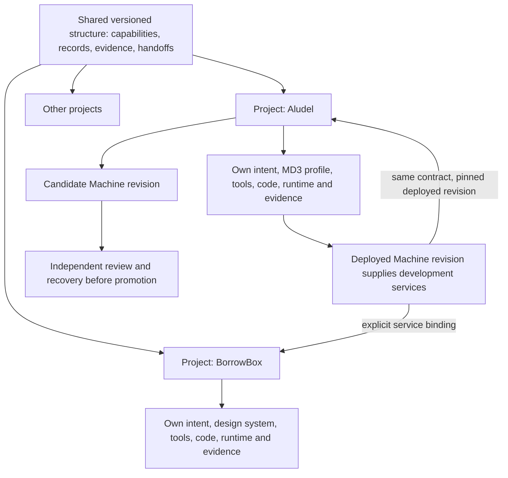

# Capabilities first, tools second

This framework describes the places where a product needs support throughout its life. It is a coverage model, not a shopping list or a new platform to build. The [capability catalog](system/capabilities.json) supplies stable IDs; [Aludel's allocation](system/the-machine.json) records current and intended provision; the [readable coverage map](system/the-machine.md) is generated from those records. The [tool registry](tool-ecosystem.md) holds vendor evaluation. A project selects from that registry without inheriting every tool.

## Shared structure, project-specific realization

**Aludel is a project within itself.** Every project, including Aludel, uses the same versioned capability vocabulary, record contracts, evidence states and allocation model. Aludel's implementation may execute that model for itself and other projects; its own stack and design language are project choices.

| Shared across projects | Specific to each project |
|---|---|
| Capability IDs and meanings; relationships among intent, stories, decisions, work, artifacts, reviews and observations | Actual audience, intent, story set, records and acceptance examples |
| Allocation/coverage schema; authority and handoff contract; evidence and readiness semantics | Selected tools, service bindings, owners, environments, permissions, costs and measured coverage |
| Design-system intake and evolution procedure; source/deviation/maturity contract | MD3 for Aludel, another design system for another project, each with its own patterns and components |
| Versioning, change impact and migration conventions | Repository/runtime/framework, schema implementation, migration and deployment strategy |
| Explicit promotion and opt-in reuse rules | Which shared resource revision a project consumes, with overrides and provenance |

Shared structure is a versioned contract, not a mandate to use one backend, frontend, design system or instance of every service. Aludel's code implements the contracts but is not identical to them. A project can use manual work or external tools to satisfy a capability, with the same evidence requirements.

**Delivery, experience and runtime are secondary usage labels.** They describe an allocation within a project; they are not an inside/outside partition of Aludel. A single provider may serve several labels, with separate output and authority boundaries. Storybook used to develop Aludel is a delivery binding on project `the-machine`; a portal feature indexing story artifacts would require separate specification and implementation in that same project's runtime.

There is no privileged project type for Aludel. Recursive service provision is explicit: `consumer_project`, `provider_project`, service contract and deployed revision. A candidate must not provide the only service needed to validate or recover itself. Keep the accepted/deployed revision or an independent local/provider path available. At bootstrap these are intended boundaries, not a working self-hosted integration.

BorrowBox is currently a fictional fixture, not a second built product. Its example allocation demonstrates that the same structure can express different product choices; it does not establish cross-project runtime portability or satisfy M3.

## The capability vocabulary

The catalog separates framing, research, product records, experience architecture, design language, component implementation, workshop/catalog, source identity, authorization, execution tracking, orchestration, agent execution, quality checks, artifact identity, preview delivery, acceptance, runtime UI, domain/data, identity/connections, production delivery/recovery, operations, learning and go-to-market. Capabilities are intentionally finer than “design,” “frontend” or “AI.” Expand a capability when different outputs require different authorities, contracts or release gates; do not expand solely because a vendor has another product.

The map covers the full ambition while marking later capabilities deferred. It does not bring all of them into M1. A deferred capability needs a trigger; a required gap needs a named packet or evidence task. Unknown is a visible state, not successful coverage.

## Per-project allocation contract

Each allocation identifies:

- capability ID, project ID, secondary usage label and deliverable/output;
- current provision (manual, experiment, partial, none, deferred, inapplicable or verified with scope), with evidence;
- target authority for that output, plus implementers, supporting tools and human reviewers;
- adoption status separately from coverage: candidate, trial-selected, selected-direction, adopted, deferred;
- what the selected tools explicitly do not cover;
- gap, next evidence/packet, project-specific lifecycle gate and substitution consequence. Project phase names never become global capability defaults.

Each handoff identifies producer → versioned payload → consumer, the authority at the boundary, validation/rejection behavior and next evidence. Tool links alone do not establish integration. Product IDs, artifact revisions and acceptance scope travel with the payload. Production credentials never travel in research records or task bundles.

One scoped output has one authoritative writer/operation. Multiple tools may contribute evidence or implement different parts. If two tools both claim authority, record a conflict before integration. Split the output or choose a boundary; never hide the conflict behind “sync.” Examples: Linear's native issue fields versus portal authorization; Figma reference frames versus code component behavior; test results versus owner acceptance.

## Practical use

At intake, ask which capabilities this task consumes or changes. Read only those allocations and their handoffs. Before selecting a tool, check the existing provider and exact unmet output. Before claiming readiness, distinguish documentation, local experiment, integrated proof and owner acceptance. A replacement changes allocations and downstream consumers; the vocabulary remains stable.

At closeout, update observed provision and link evidence. Re-run the map check. Do not promote a candidate simply because its entry exists. Use this source representation until a real portal record replaces it; migration should preserve IDs and generate exports, not create a second manually edited truth.

For another project, explicitly assess every capability as required, deferred or inapplicable with reason. Reuse the catalog and template, not Aludel's vendor assignments. Services or assets may be shared through an explicit, revision-bound project relationship. No assignment is inherited from Aludel merely because it manages a project.

## Bounded checks

`python3 tools/check_product_system.py` validates catalog coverage, unique scoped ownership, local evidence paths, status vocabulary and handoff references, then emits the readable map with `--write`. It also identifies required unproven capabilities. A passing structural check means the map is internally consistent; it does not mean the listed tools work together.

The [BorrowBox fixture map](system/borrowbox.md) uses the same schema without assuming MD3 or Aludel's application stack. The [application record](design/portal-system/v1/work-record.md) records actual findings and negative-case checks. Future effectiveness should be measured by gaps caught before integration, avoided duplicate implementations and smaller agent context—not by the number of entries.
